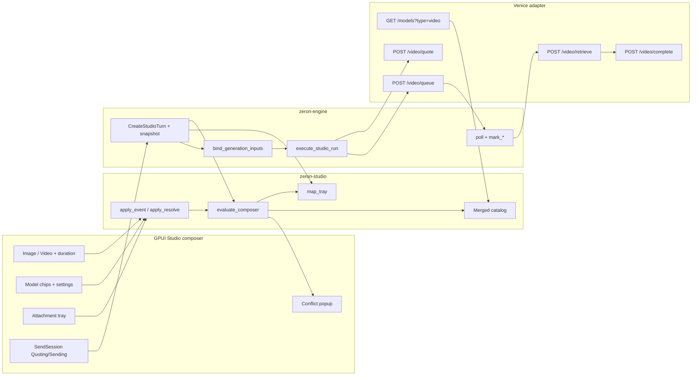
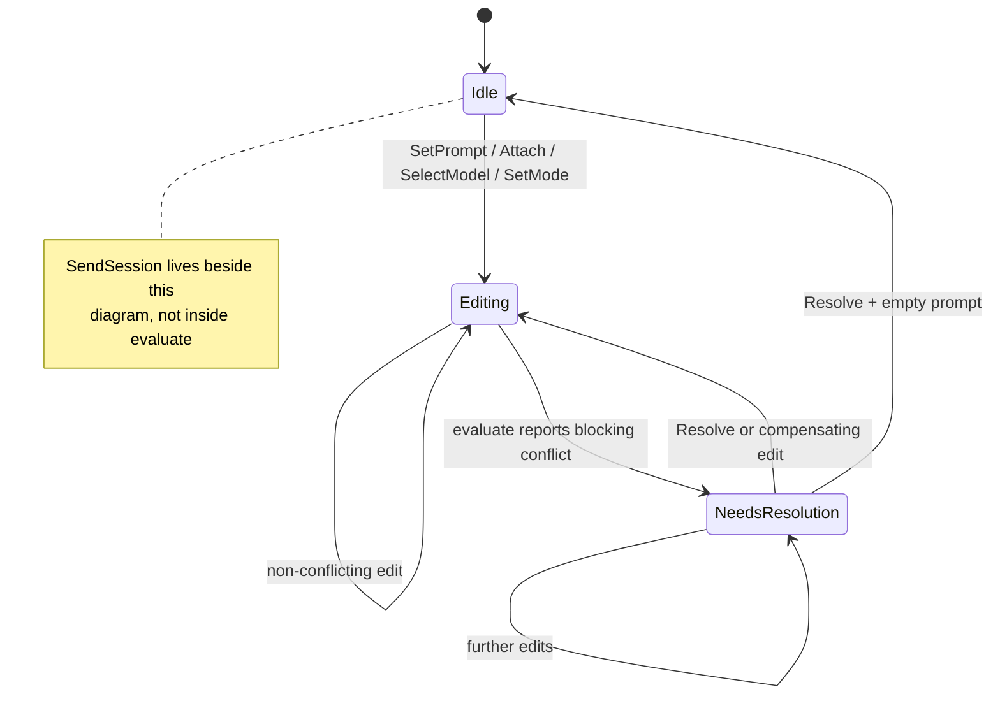
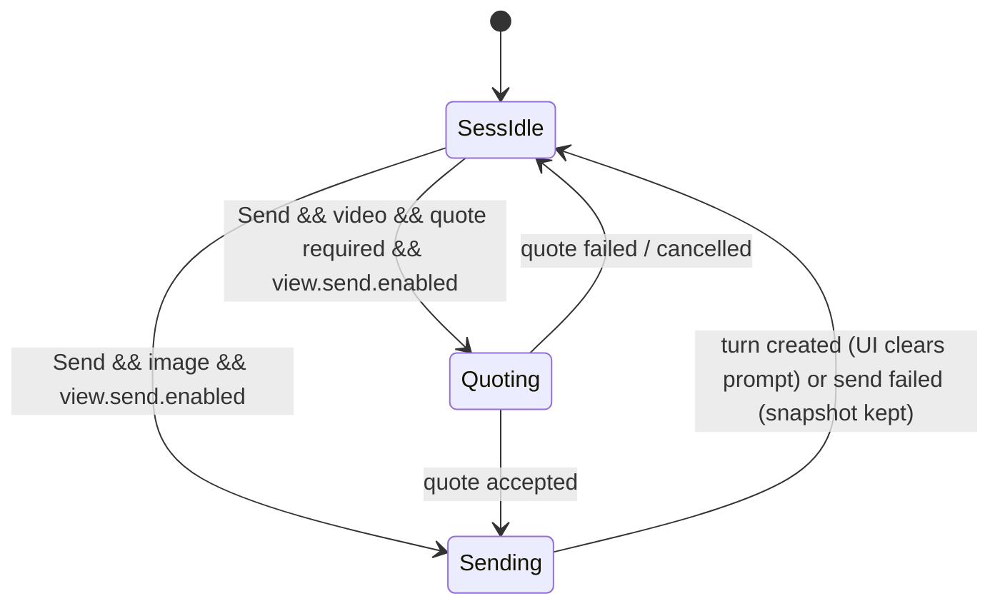
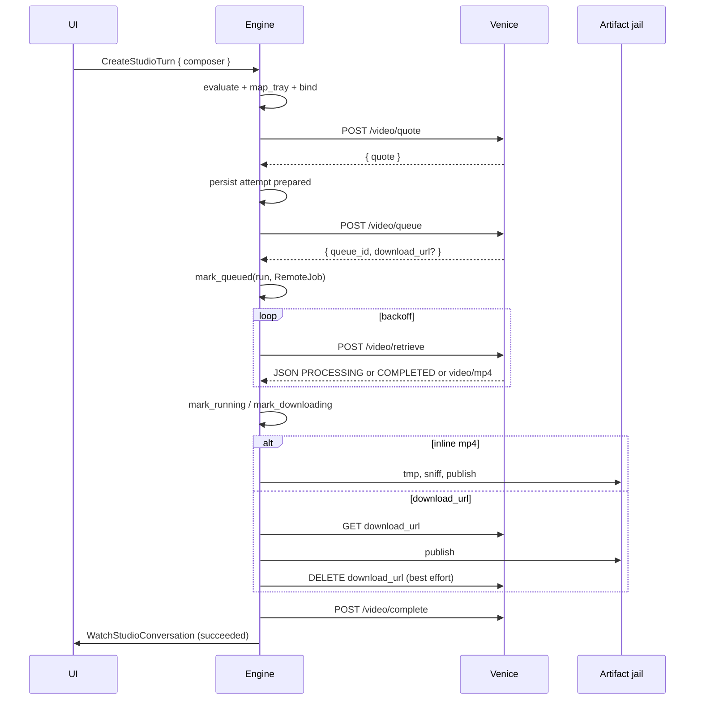

# Studio video generation — engine-first composer state machine

| Field | Value |
| --- | --- |
| **Title** | Studio video generation: engine-first composer state machine |
| **Author** | TBD |
| **Date** | 2026-08-18 |
| **Status** | Accepted (v1) |
| **Extends** | [docs/studio-plan.md](docs/studio-plan.md), [docs/studio-venice-spike.md](docs/studio-venice-spike.md) |
| **Reviewed against** | Venice `GET /api/v1/models` swagger 20260818.121409, `/video/quote`, `/video/queue`, `/video/retrieve`, `/video/complete`, Seedance 2.0/2.5 guide, Reference-to-Video guide, checked-in fixtures under `crates/studio/tests/fixtures/venice/` |

This document does **not** replace the studio plan. Phase 1 (conversation-based image) is shipped. Phase 2 in the plan starts at asset import, then T2V/I2V UI. This design **inserts** a composer state machine and R2V capability work in front of that UI, and splits the runner so video submit cannot land before poll/resume exist. That is a justified extension, not a reopen of the plan’s storage, provider, quote, or playback decisions.

---

## Overview

Zeron Studio already has a conversation-based image composer: N selected models become N `StudioModelRunSpec`s, the engine validates each against a `MediaModel` manifest, and `CreateStudioTurn` appends an immutable turn. Video must use that same composer and the same thread. A studio conversation can already store `media_kind = 'video'` **artifacts**; what is missing is catalog completeness, a tray→role mapper, conflict resolution, asset import (including duration), and the async quote → queue → poll → retrieve → complete runner.

Video is harder than image because selected models do not share a form. Some accept reference images, some do not. Some accept reference video or audio. Durations, resolutions, aspect ratios, and prompt limits differ. The live Venice catalog advertises some of this and silently omits the rest. The engine must own a merged capability surface so the UI never invents a limit and never leaves the user in a silent invalid state.

The proposed solution is an engine-owned **composer state machine**. All composer types live in `zeron-studio`. Proto re-exports them (the `MediaModel` pattern). The UI emits typed events. A pure function `evaluate_composer` returns a `ComposerView`. Send sends the **same** `ComposerSnapshot`; the engine re-evaluates, projects runs via `map_tray`, and rejects with a structured `StudioValidationError`. Live and send-time share one snapshot and one type family.

---

## Background & Motivation

### Current state (2026-08-18)

Phase 1 is complete. Accurate inventory (false “existing” claims from the first draft are corrected here):

| Layer | What exists | Video gap |
| --- | --- | --- |
| `zeron-studio::MediaModel` | Operation, input roles, prompt caps, controls, pricing. **No** `image_capability()`. | Video input roles stop at a single `source`. Live fields `audio_input`, `video_input`, `per_reference_audio`, reference-image geometry are dropped. `model_type` has no `reference-to-video`. |
| `ControlValue` | `DurationSeconds { f64 }`, `AspectRatio`, `AspectRatioAuto`. **No** duration-auto, **no** `adaptive` aspect. | `duration_control` requires a trailing `s` and drops the **whole model** on parse failure. `parse_aspect_ratio` does not accept `adaptive`. |
| `GenerationRequest::validate_against` | Provider/model/operation, output count, prompt length, control kinds, **role counts**. | No MIME / geometry / duration checks against bytes. No composer intersection. |
| `MimeConstraint` | `PartialEq + Eq`; width/height/bytes only. | Geometry ratios and duration floors are `f64` and will break `Eq`. |
| `VeniceMediaProvider::list_models` | Merges `image` + `upscale` + `inpaint` only (`venice_provider.rs`). | Never fetches `?type=video`. |
| `VeniceMediaProvider::quote` | Builds a video quote payload; formats duration as `{n}s`. | No `auto`/`-1`; no `reference_video_total_duration`; Grok/Kling unsuffixed durations would 400. |
| `VeniceMediaProvider::submit` | T2I / edit / upscale only | Explicit `Unsupported` for video. |
| `PollResult` | `Queued \| Running \| Completed \| Failed { error }` | **No** `Transient` variant. 503 must be `Failed { kind: Transient }`. |
| `execute_studio_run` | Sync `Submission::Completed` | `Submission::Queued` is a hard failure: `"provider queued an image job that this release cannot poll"` (`rpc.rs`). |
| `studio_attempts.remote_job_id` | Column exists | **Nothing writes it.** There is no `mark_queued`. |
| `recover_interrupted_image_runs` | Marks `queued`/`running` `submission_unknown` and fails the run | Ignores `remote_job_id`. Startup (`lib.rs`) only calls this. |
| `bind_generation_inputs` / `resolve_generation_inputs` | Assets **only** as ImageEdit masks; artifacts **only** `MediaKind::Image`; sniff error is “not a supported image” | Every I2V/R2V reference will fail until these gates lift. |
| `studio_assets` | `width`/`height`; **no** `duration_seconds`; `publish_asset` accepts jpeg/png/webp only | Not ready for video/audio import. Schema v3. |
| `studio_artifacts` | `media_kind IN ('image','video')`, `duration_seconds` | Ready for **outputs**. `complete_run` already skips `derive_preview` for non-images. |
| RPC methods (`crates/rpc/src/lib.rs`) | Studio list/create/quote/retry/delete/read-chunk | **No** `CancelStudioRun`. **No** `ImportStudioAsset`. **No** `RevealStudioArtifact`. `RpcError::Failed(String)` only; `ServerFrame.err` is `Option<String>`. |
| UI composer | Image picker, per-model chips, `×N`, `set_control` writes drafts locally | Hardcodes `mediaKind: "image"`. One `selected_model_ids` list. `select_first_model` auto-picks. |
| Feed | Mixed-media tests exclude video from the lightbox count | No poster / Open chrome. `ReadStudioArtifactChunk` exists; OS open is not specified. |

The spike (`docs/studio-venice-spike.md`, reviewed 2026-08-16) is still correct on catalog honesty and quote-as-price: do not infer reference support from an ID substring; hide controls the live catalog does not advertise; quote is the source of video price. **Playback is decided:** in-app studio lightbox (not OS-player-only). OS-player remains Open/Export fallback.

### Pain points this design removes

1. **Silent invalid drafts.** Switching from an I2V/R2V model to a T2V model while images are attached must not quietly drop the images or let Send fail with a generic RPC string.
2. **UI-owned Venice knowledge.** The composer must not hardcode “Seedance 2.5 allows 30 images.”
3. **Image recovery applied to video.** Restart mid-poll must resume the same `queue_id` exactly once.
4. **Catalog hole.** `list_models` never asks Venice for video.
5. **Send path that cannot accept the tray.** Live evaluate and `CreateStudioTurn` share one snapshot; `map_tray` is the only mapper; bind/resolve gates lift for video roles.

### Non-negotiable existing decisions (not reopened)

- One conversation, mixed image and video artifacts, immutable turns.
- N selected models → N jobs. No “N videos from one model.”
- Provider-neutral types in `zeron-studio`; Venice wire types stay in the adapter.
- Merge precedence: live model constraint, then reviewed overlay, then endpoint default. Never infer from a similarly named model.
- Quote confirmation whenever the provider returns a quote; do not invent a local video price.
- In-app lightbox playback for video. OS-player is Open/Export fallback, not the only player.
- iOS is out of the first **UI** slice; the protocol must remain usable by it later.

---

## Goals & Non-Goals

### Goals

1. Formalize the studio composer as an engine-owned state machine. Draft phases are `Idle | Editing | NeedsResolution`. Send session (`Quoting | Sending`) is **not** a function of the snapshot.
2. Ship a provider-agnostic capability catalog, `map_tray`, intersection helpers for **globals**, remaining-budget numbers, and a checked-in Venice overlay with a complete TOML schema.
3. Share one type family (`zeron-studio`, proto re-exports) for live evaluate and send-time validate. `CreateStudioTurn` carries the snapshot.
4. Reuse the existing variation model: one video per selected model.
5. Duration is global; resolution, aspect, and audio are per-model.
6. Conflicts are first-class `ComposerConflict` values with typed `ResolveAction`s, rendered as a popup over the composer. No silent drops.
7. Implement Venice video quote → queue → poll → retrieve → complete, with `mark_queued` and durable resume after restart.
8. Let image-mode and video-mode sends append to the same thread. Never mix image and video **runs** in one send. Mixed **video operations** (T2V+I2V+R2V) are allowed iff every model `map_tray`s.
9. Incremental PRs. Engine first. Do not lift video **submit** until the runner can persist and poll `queue_id`.

### Non-Goals

- Agent mode in the segmented control.
- Multiple videos from one model in one send.
- **Kling O3 R2V in the v1 picker.** Flattening to `reference_image_urls` does not match the live `elements` / `image_urls` wire (swagger `elements.maxItems` is 4; the product guide allows 7 combined stills). Catalog rows may be normalized and then **hidden** (`adapter_family = "hidden"`). Structured element tray is a later PR. **Decided: Kling stays Hidden in v1.**
- Seedance Edit / Extend / Stitch prompt-routing UI in v1 (prompt-only; do not send `omni_reference_task_type`). **Decided: ship R2V references only.**
- Public Seedance consent attestation (`consents.seedance`).
- Video upscale (`topaz-video-upscale`) in the generate composer.
- Negative prompt in the video composer (the adapter may keep copying the prompt cap onto `negative_prompt_maximum_chars` for catalog compatibility; the video bar does not expose or send it).
- Rewriting the user prompt (including Grok `@ImageN` injection). v1 does not mutate prompt text; Venice prepends tags if omitted.
- `CancelStudioRun`. It is not an RPC today and Venice cannot cancel. Do not add it in this slice.
- `ResolveStudioComposer` RPC. `apply_resolve` is a pure `zeron-studio` function; clients apply it locally and re-evaluate.
- iOS studio composer / native playback.
- Cloud gallery, device-relay video bytes, public hosting of references, or Loro-synced media.
- Silently truncating the user’s prompt.
- Data-URL workarounds that exceed Venice’s 35 MB queue body. Refuse with `QueuePayloadTooLarge`.

---

## Proposed Design

### Where the new code lives

One type family. Proto re-exports. Engine RPC is a thin wrapper.

```text
crates/studio/src/
  composer.rs          # snapshot, events, evaluate(), map_tray(), apply_resolve(), budgets
  catalog.rs           # global intersection, overlay apply, VideoCapability
  probe.rs             # image / mp4 / wav duration+geometry
  venice.rs            # VideoConstraints extras, duration/aspect parsers, wire helpers
  venice_overlay.rs    # TOML load, inherit, longest-prefix
  venice_video.rs      # per-family queue/quote field tables (Seedance / Grok)
  venice_provider.rs   # fetch ?type=video; quote/queue/poll/complete
  overlays/venice/
    video.toml         # full schema below

crates/proto/src/studio.rs
  # pub use zeron_studio::{ComposerSnapshot, ComposerView, ...}
  # CreateStudioTurnRequest { composer: Option<ComposerSnapshot>, ... }
  # StudioValidationError
  # ImportStudioAsset* frames

crates/rpc/src/lib.rs
  # EVALUATE_STUDIO_COMPOSER, IMPORT_STUDIO_ASSET
  # ServerFrame.err_payload + RpcError::FailedStructured

crates/engine/src/
  studio.rs            # schema v4, import, mark_queued/running/downloading, resume
  rpc.rs               # evaluate wrapper; CreateStudioTurn from snapshot
```

The UI (`crates/ui/src/studio/{composer,draft,page,defaults}.rs`) is a renderer of `ComposerView` plus an event source. It **must not** compute duration intersection, role mapping, or send-enablement. `set_control` may still write per-model resolution/aspect/audio into the snapshot; it must not write global duration except via `SetDuration` → `apply_event`. On Image/Video toggle the UI loads the matching remembered list from `StudioDefaults` and emits `SetMode { mode, restore }` — it does not apply the list itself.

### High-level architecture



---

## Capability catalog

### Provider-agnostic surface

Keep `MediaModel` as the persistable manifest. Add a **new** derived view (not an existing method):

```rust
/// Semantic input roles the composer tray understands.
/// Wire adapters map these onto provider fields.
pub const ROLE_SOURCE: &str = "source";
pub const ROLE_LAST_FRAME: &str = "last_frame";
pub const ROLE_REFERENCE: &str = "reference";
pub const ROLE_REFERENCE_VIDEO: &str = "reference_video";
pub const ROLE_REFERENCE_AUDIO: &str = "reference_audio";
pub const ROLE_AUDIO: &str = "audio";
// ROLE_VIDEO is reserved. VideoToVideo uses `source` (same as I2V).
// Do not emit ROLE_VIDEO unless a future overlay row advertises it.
pub const ROLE_ELEMENT: &str = "element";   // reserved; Kling hidden in v1
pub const ROLE_SCENE: &str = "scene";       // reserved
pub const ROLE_KEYFRAME: &str = "keyframe"; // reserved

#[derive(Clone, Debug, PartialEq)]
pub struct VideoCapability {
    pub operation: MediaOperation,
    pub adapter_family: AdapterFamily, // Seedance | Grok | Hidden
    pub prompt_maximum_chars: Option<u32>,
    pub durations: Vec<ControlValue>,  // DurationSeconds and/or DurationAuto
    pub resolutions: Vec<String>,
    pub aspect_ratios: Vec<ControlValue>, // AspectRatio | AspectRatioAuto | AspectRatioAdaptive
    pub generate_audio: AudioCapability,
    pub inputs: Vec<InputConstraint>,
    pub requires_visual_reference: bool,
    pub reference_audio_requires_visual: bool,
    pub source_matched_duration: bool,
    pub source_matched_aspect: bool,
}

#[derive(Clone, Copy, Debug, PartialEq, Eq)]
pub enum AdapterFamily {
    Seedance,
    Grok,
    Hidden, // default when the overlay omits adapter_family; also Kling / Topaz
}

#[derive(Clone, Copy, Debug, PartialEq, Eq)]
pub enum AudioCapability {
    None,                          // omit `audio` on the wire
    ForcedOn,                      // always send `audio: true`; no toggle
    Configurable { default: bool },
}

impl MediaModel {
    /// Derived. Returns None when `output_kind != Video`.
    pub fn video_capability(&self) -> Option<VideoCapability> { /* … */ }
}
```

There is **no** `image_capability()`. Image generate keeps walking `controls` / `input_constraints` as today.

### ControlValue additions

Add to `crates/studio/src/model.rs` (PR 1, before the overlay lands):

```rust
pub enum ControlValue {
    // existing variants…
    AspectRatio { width: u32, height: u32 },
    AspectRatioAuto,                 // wire "auto"
    AspectRatioAdaptive,             // wire "adaptive" (Seedance source-matched)
    Resolution { value: String },
    DurationSeconds { value: f64 },
    DurationAuto,                    // wire "auto" or "-1" per family table
}
```

`ControlValue::kind()` maps both duration variants to `ControlKind::Duration`, and both auto/adaptive aspect variants to `ControlKind::AspectRatio`.

Duration parser (`duration_control`):

- Accept `"{n}s"`, `"{n}"`, `auto` / `Auto`, `-1`.
- Invalid **choice** strings are skipped; the model is kept if at least one valid duration remains. If **zero** valid durations remain, skip the model (same as today for an unusable row).
- Do **not** fail the whole catalog.

Aspect parser:

- `auto` → `AspectRatioAuto` (existing).
- `adaptive` → `AspectRatioAdaptive` (new).
- `W:H` unchanged.

`duration_control` default remains `None` on the **model control**. The composer seeds the **global** duration; `evaluate` copies it onto each chip. `DraftRunConfig::from_model` still will not copy duration (no default). That is intentional: chips get duration only from the global seed.

### MimeConstraint

```rust
#[derive(Clone, Debug, PartialEq, Serialize, Deserialize)] // no Eq
pub struct MimeConstraint {
    pub accepted: Vec<String>,
    pub maximum_bytes: Option<u64>,
    pub maximum_width: Option<u32>,
    pub maximum_height: Option<u32>,
    #[serde(default)]
    pub minimum_short_side: Option<u32>,
    #[serde(default)]
    pub minimum_aspect_ratio: Option<f64>,
    #[serde(default)]
    pub maximum_aspect_ratio: Option<f64>,
    #[serde(default)]
    pub minimum_duration_seconds: Option<f64>,
    #[serde(default)]
    pub maximum_duration_seconds: Option<f64>,
    #[serde(default)]
    pub maximum_total_duration_seconds: Option<f64>,
}
```

**Drop `Eq` on `MimeConstraint` and on `InputConstraint`** in the same PR as these fields (`f64` is not `Eq`). Call sites that relied on `Eq` switch to `PartialEq`. These fields are submit-relevant and participate in `manifest_version`.

### What Venice advertises live

`GET /api/v1/models?type=video` → `model_spec.constraints` (swagger *Video Model Constraints*, version `20260818.121409`):

| Field | In swagger | In Seedance 1.5 fixtures | Current adapter (`VideoConstraints`) |
| --- | --- | --- | --- |
| `model_type` enum `text-to-video` \| `image-to-video` \| `video` | Yes | Yes | Mapped. Unknown types skipped. **No `reference-to-video`.** |
| `aspect_ratios` | Yes; empty = unsupported | T2V listed; I2V `[]` | Empty hides the control. Correct. |
| `resolutions` | Yes | `1080p`, `720p`, `480p` | Choice control. |
| `durations` | Yes (`"4s"` …) | `4s`–`12s` | Required duration control. No default today. |
| `audio` | Yes | `true` | Combined with `audio_configurable`. |
| `audio_configurable` | Yes | `true` | Combined. |
| `prompt_character_limit` | Yes; default 2500 | `3500` | Parsed. Default 2500 if absent. |
| `audio_input` | **No** | `false` | **Dropped.** Parse in PR 1. |
| `per_reference_audio` | **No** | `false` | **Dropped.** Parse in PR 1. |
| `video_input` | **No** | `false` | **Dropped.** Parse in PR 1. |
| `reference_image_min_short_side_pixels` | **No** | `300` (I2V) | **Dropped.** Parse in PR 1. |
| `reference_image_min_aspect_ratio` | **No** | `0.4` | **Dropped.** Parse in PR 1. |
| `reference_image_max_aspect_ratio` | **No** | `2.5` | **Dropped.** Parse in PR 1. |
| reference image/video/audio **counts** | **No** | **No** | Overlay only. |
| per-clip duration / byte caps | **No** | **No** | Overlay only. |

Swagger `model_type` is only `image-to-video | text-to-video | video`. **Do not promote a row to `ReferenceToVideo` because its id contains `reference`.** Promotion happens only via an explicit overlay row (`operation = "reference_to_video"`). Drift CI fails if a live fixture is `image-to-video` and an overlay promotes it — that promotion must be reviewed, not accidental.

Queue endpoint schema (upper bounds, **not** per-model grants):

| Queue field | Max items | Maps to role |
| --- | --- | --- |
| `image_url` | 1 | `source` |
| `end_image_url` | 1 | `last_frame` |
| `audio_url` | 1 | `audio` (≤30s, 15 MB, WAV/MP3) |
| `video_url` | 1 | `video` |
| `reference_image_urls` | 30 | `reference` |
| `reference_video_urls` | 10 | `reference_video` |
| `reference_audio_urls` | 10 | `reference_audio` |
| `elements` / `scene_image_urls` / `keyframes` / `reference_document_urls` | — | reserved; Hidden in v1 |

Endpoint maxima are a ceiling. A model that does not have a positive overlay/live count for a role **does not accept that role**.

### Overlay TOML schema

File: `crates/studio/overlays/venice/video.toml`

**Required keys**

| Key | On `[[model]]` | On `[[family]]` |
| --- | --- | --- |
| `id` xor `id_prefix` | `id` required | `id_prefix` required |
| `source` | required (unless `inherit`) | required (unless `inherit`) |
| `reviewed` | required (unless `inherit`) | required (unless `inherit`) |
| `operation` | required (unless `inherit`) | required (unless `inherit`) |

`inherit = "<id or id_prefix of another row>"` copies every optional key from that row, then this row’s keys override. Inherited rows still need their own `id` / `id_prefix`. Cycles are a load error. Missing inherit target is a load error.

**Default `adapter_family`:** if a live video model has **no** overlay row, or the matching row omits `adapter_family`, the family is **`Hidden`**. Do not guess Seedance. Hidden models are omitted from `ListStudioModels` picker results. A snapshot that still has a Hidden id selected (restore, Use prompt, stale defaults) evaluates as `StaleModel` (`DropVanishedModels`).

**Overlay sentinels:** when `source_matched_duration = true`, overlay apply **inserts** `ControlValue::DurationAuto` into `controls["duration"].choices` if it is not already present. When `source_matched_aspect = true`, insert `ControlValue::AspectRatioAdaptive` into `controls["aspect_ratio"].choices` (create the aspect control with only that choice if live `aspect_ratios` is empty). Live discrete lists stay authoritative for concrete values; the flags only add the source-matched sentinel. Without this insert, Seedance 2.5 R2V can never offer Auto / adaptive because the live catalog lists `"4s"`…`"30s"` only.

PR 1 test: Seedance 2.5 R2V fixture (or a renamed-id copy) + overlay ⇒ duration choices contain `DurationAuto`; aspect choices contain `AspectRatioAdaptive`.

**Optional keys** (default: unset → do not grant the role / flag)

```toml
adapter_family = "seedance" | "grok" | "hidden"
requires_visual_reference = true | false
reference_audio_requires_visual = true | false
source_matched_duration = true | false
source_matched_aspect = true | false
reference_images = { min = 0, max = 9 }
reference_videos = { min = 0, max = 3 }
reference_audios = { min = 0, max = 3 }
last_frame = { min = 0, max = 1 }
per_reference_video_seconds = { min = 2.0, max = 15.0 }
total_reference_video_seconds = 15.0
per_reference_audio_seconds = { min = 2.0, max = 15.0 }
total_reference_audio_seconds = 15.0
per_reference_image_bytes = 31457280
per_reference_video_bytes = 52428800
per_reference_audio_bytes = 15728640
```

**Match policy:** exact `id` wins. Else **longest** `id_prefix` that is a prefix of the model id among rows listed in this file. Ties (equal length) are a load error. No runtime substring guessing.

**Sample (complete rows, not sketches):**

```toml
# Review: 2026-08-18
# Sources:
#   https://docs.venice.ai/guides/media/seedance-2-0
#   https://docs.venice.ai/guides/media/reference-to-video
#   https://docs.venice.ai/api-reference/endpoint/video/queue
#   crates/studio/tests/fixtures/venice/text-to-video-model.json
#   crates/studio/tests/fixtures/venice/image-to-video-model.json

[[model]]
id = "seedance-1-5-pro-text-to-video-basic"
operation = "text_to_video"
adapter_family = "seedance"
source = "live fixture + swagger"
reviewed = "2026-08-18"
# no reference_* keys → T2V stays input_constraints: []

[[model]]
id = "seedance-1-5-pro-image-to-video-basic"
operation = "image_to_video"
adapter_family = "seedance"
source = "live fixture + swagger"
reviewed = "2026-08-18"
# last_frame not advertised live; omit

[[family]]
id_prefix = "seedance-2-0-reference-to-video"
operation = "reference_to_video"
adapter_family = "seedance"
source = "https://docs.venice.ai/guides/media/seedance-2-0"
reviewed = "2026-08-18"
requires_visual_reference = true
reference_audio_requires_visual = true
reference_images = { min = 0, max = 9 }
reference_videos = { min = 0, max = 3 }
reference_audios = { min = 0, max = 3 }
per_reference_video_seconds = { min = 2.0, max = 15.0 }
total_reference_video_seconds = 15.0
per_reference_audio_seconds = { min = 2.0, max = 15.0 }
total_reference_audio_seconds = 15.0
per_reference_video_bytes = 52428800
source_matched_aspect = true

[[family]]
id_prefix = "seedance-2-0-fast-reference-to-video"
inherit = "seedance-2-0-reference-to-video"
source = "https://docs.venice.ai/guides/media/seedance-2-0"
reviewed = "2026-08-18"
# resolutions come from live catalog (480p/720p)

[[family]]
id_prefix = "seedance-2-5-reference-to-video"
inherit = "seedance-2-0-reference-to-video"
source = "https://docs.venice.ai/guides/media/seedance-2-0"
reviewed = "2026-08-18"
reference_images = { min = 0, max = 30 }
reference_videos = { min = 0, max = 10 }
reference_audios = { min = 0, max = 10 }
per_reference_video_seconds = { min = 2.0, max = 30.0 }
total_reference_video_seconds = 30.0
per_reference_image_bytes = 31457280
source_matched_duration = true

[[family]]
id_prefix = "seedance-2-0-image-to-video"
operation = "image_to_video"
adapter_family = "seedance"
source = "https://docs.venice.ai/guides/media/seedance-2-0"
reviewed = "2026-08-18"
last_frame = { min = 0, max = 1 }

[[family]]
id_prefix = "seedance-2-5-image-to-video"
inherit = "seedance-2-0-image-to-video"
source = "https://docs.venice.ai/guides/media/seedance-2-0"
reviewed = "2026-08-18"

[[family]]
id_prefix = "grok-imagine-reference-to-video"
operation = "reference_to_video"
adapter_family = "grok"
source = "https://docs.venice.ai/guides/media/reference-to-video"
reviewed = "2026-08-18"
requires_visual_reference = true
reference_images = { min = 1, max = 7 }
# matches grok-imagine-reference-to-video and *-private (download_url path)

[[model]]
id = "kling-o3-pro-reference-to-video"
operation = "reference_to_video"
adapter_family = "hidden"
source = "https://docs.venice.ai/guides/media/reference-to-video"
reviewed = "2026-08-18"
reference_images = { min = 1, max = 7 }
# picker hides Hidden; no v1 wire mapping
```

`min = 0` on R2V image/video roles is correct **because** `requires_visual_reference` is the cross-role constraint. Do not encode “≥1 visual” as `reference_images.min = 1` (that would reject a video-only R2V tray).

CI:

- Fail if a live fixture constraint key is unknown to the parser.
- Fail if a live fixture `model_type == image-to-video` and an overlay sets `operation = reference_to_video` without that row having its own `reviewed` (promotions must be explicit).
- Fail if a T2V fixture gains any `reference_*` input after overlay apply.
- Every `source` is a listed URL or `live fixture + swagger`.

### Merge precedence (unchanged)

1. Live model constraint (durations, resolutions, aspect, audio flags, prompt limit, geometry if present).
2. Overlay row (operation promotion, role counts, duration/byte floors, flags, `adapter_family`).
3. Endpoint default (prompt 2500; output MIME `video/mp4`). **Never** grant a reference role from the queue schema ceiling alone.

If a role’s support cannot be established, **hide it**.

### Concrete capability matrix

Built from fixtures + official docs. “Live” = present on the model object. “Overlay” = checked-in. “Hidden” = not established / not selectable.

#### Seedance 1.5 Pro T2V — `seedance-1-5-pro-text-to-video-basic`

| Capability | Value | Source |
| --- | --- | --- |
| Operation | `TextToVideo` | live `model_type` |
| Prompt | 3500 chars | live |
| Durations | 4–12 s inclusive | live |
| Resolutions | 1080p, 720p, 480p | live |
| Aspect | 21:9, 16:9, 4:3, 1:1, 3:4, 9:16 | live |
| Generate audio | Configurable, default on | live |
| References | none | live `audio_input/video_input/per_reference_audio = false` + no overlay roles |
| Output count | 1 | adapter |
| Output MIME | `video/mp4` | adapter |
| Adapter family | Seedance | overlay |

#### Seedance 1.5 Pro I2V — `seedance-1-5-pro-image-to-video-basic`

| Capability | Value | Source |
| --- | --- | --- |
| Operation | `ImageToVideo` | live |
| Source images | 1 required | live type + adapter `source` |
| Last frame | hidden | not advertised |
| Aspect control | hidden | live `aspect_ratios: []` |
| Image geometry | short side ≥ 300 px; aspect (0.4, 2.5) exclusive | live extra fields |
| Prompt / duration / resolution / audio | same as T2V sibling | live |

#### Seedance 2.0 T2V / I2V / R2V / Fast

| | T2V | I2V | R2V | Fast * |
| --- | --- | --- | --- | --- |
| Resolutions | 480 / 720 / 1080 / **4k** | same; no `aspect_ratio` | same | **480 / 720 only** |
| Output duration | 4–15 s | 4–15 s | 4–15 s | 4–15 s |
| Source / last frame | — | 1 + optional last | — | same as family |
| Ref images | 0 | 0 | 0–9; `requires_visual_reference` | same |
| Ref videos | 0 | 0 | ≤ 3; 2–15 s each; ≤ 15 s total; ≤ 50 MB | same |
| Ref audio | 0 | 0 | ≤ 3; not solo | same |
| Source-matched aspect | n/a | n/a | `adaptive`/`auto` | same |
| Source | [Seedance 2.0 & 2.5](https://docs.venice.ai/guides/media/seedance-2-0) | same | same | same |

#### Seedance 2.5 T2V / I2V / R2V

| | T2V | I2V | R2V |
| --- | --- | --- | --- |
| Resolutions | 480 / 720 | 480 / 720; no aspect | 480 / 720 |
| Output duration | 4–30 s (docs default 10) | 4–30 s | 4–30 s; `DurationAuto` for edit |
| Ref images | 0 | 0 | 0–30; ≤ 30 MB each; `requires_visual_reference` |
| Ref videos | 0 | 0 | ≤ 10; 2–30 s; ≤ 30 s total |
| Ref audio | 0 | 0 | ≤ 10; not solo |
| Source-matched duration | n/a | n/a | yes (edit) |

#### Grok Imagine R2V — `grok-imagine-reference-to-video`

| Capability | Value | Source |
| --- | --- | --- |
| Ref images | 1–7 flat | [Reference to Video](https://docs.venice.ai/guides/media/reference-to-video) |
| Aspect | 16:9, 4:3, 3:2, 1:1, 2:3, 3:4, 9:16 | same |
| Resolution | 480p, 720p | same |
| Duration | 5 / 8 / 10 s (unsuffixed on the wire) | same |
| Audio | `None` — **omit** the field | same |
| Prompt tags | Venice prepends `@ImageN` if omitted; v1 does not rewrite | same |
| Private variants | `id_prefix` `grok-imagine-reference-to-video` covers `*-private`. `download_url` at queue time; persist on `RemoteJob.metadata`; never send to UI | video-generation guide |

#### Kling O3 R2V

Normalized if present, `adapter_family = Hidden`, **not in the v1 picker**. Do not map `reference` → `reference_image_urls` (that would 400).

#### Shared media floors

| Constraint | Value |
| --- | --- |
| Image formats (v1 accept) | jpeg, png, webp |
| Image aspect | exclusive (0.4, 2.5) when advertised |
| Image min short side | 300 px when advertised |
| Video formats | mp4, mov |
| Per-clip video | ≤ 50 MB |
| Per-clip audio | ≤ 15 MB; wav/mp3 |
| Queue JSON body | ≤ 35 MB raw HTTP body |
| Studio import cap | 64 MiB per asset |

### Global intersection (duration and prompt only)

```rust
pub struct CapabilityIntersection {
    pub durations: Vec<ControlValue>,      // intersection of selected duration choice sets
    pub prompt_maximum_chars: Option<u32>, // min of selected
}

pub fn intersect_video_globals<'a>(
    models: impl IntoIterator<Item = &'a MediaModel>,
) -> CapabilityIntersection;
```

- **Globals must be valid for every selected model.** Duration is the only video global. Empty duration intersection → `DisjointDurations`.
- **Per-model settings do not intersect.** Resolution, aspect, audio stay on the chip.
- **Attachments are not an intersection.** They are a global tray mapped **per model** by `map_tray`. Send requires every selected model to map successfully.
- Empty selected set → `EmptyModelSet`. In **video** mode we do **not** auto-select the first catalog row (`select_first_model` stays image-only).

---

## Tray → role mapping

This is the missing contract. Attachments are composer-global. Roles are per-run. The two statements in the first draft are replaced by this function.

```rust
/// Pure. Assigns each committed tray item a role for `model`, or returns
/// one blocking conflict. Does not mutate the snapshot.
pub fn map_tray(
    snapshot: &ComposerSnapshot,
    model: &MediaModel,
) -> Result<Vec<GenerationInput>, ComposerConflict>;
```

`evaluate_composer` calls `map_tray` once per selected model (image **and** video). `CreateStudioTurn` / `QuoteStudioBatch` call it again to project `StudioModelRunSpec.inputs`. Image-mode generate models return `Ok(vec![])` — the tray is **ignored**, not leftover — so visiting Video with stills and switching back to Image does **not** block send.

`ImageEdit` and `Upscale` are not on this composer (`apply_models` already partitions them out). If one appears in `selected`, evaluate emits `StaleModel` / `IncompatibleModeModels` and does not call `map_tray` for leftovers.

### Algorithm

Inputs: `snapshot.attachments` in attach order (committed only; `pending == true` items are ignored by `map_tray` and block send separately). `model.input_constraints` + `VideoCapability` flags (video ops only).

1. **Skip pending.** If any attachment is `pending`, `evaluate` sets `send.enabled = false` (no popup; the chip/tray shows a spinner).
2. **Image generate ops return immediately.** `TextToImage` and `ImageToImage` → `Ok(vec![])`. Do not partition, do not treat stills as leftovers, do not inspect video capability.
3. **Partition** remaining items by `ComposerMediaKind` (`Image` / `Video` / `Audio`), preserving order.
4. **Apply `role_hint` first.** If `attachment.role_hint` is `Some(role)` and the model has that role with remaining capacity and compatible MIME/kind, assign it. If the hint is illegal for this model, ignore the hint and fall through to defaults (do not fail solely on a stale hint).
5. **Default assignment by `model.operation`:**

| Operation | Images (remaining) | Videos (remaining) | Audio (remaining) |
| --- | --- | --- | --- |
| `TextToImage` / `ImageToImage` | ignored (`Ok(vec![])` at step 2) | ignored | ignored |
| `ImageEdit` / `Upscale` | not on this composer | — | — |
| `TextToVideo` | leftover → conflict | leftover → conflict | leftover → conflict |
| `ImageToVideo` | 1st → `source` if `source` exists; 2nd → `last_frame` **only if** that role’s `maximum_count > 0`; further stills → `reference` iff `reference.maximum_count > 0`; else leftover | `reference_video` iff max > 0 else leftover | `audio` or `reference_audio` iff max > 0 else leftover |
| `ReferenceToVideo` | all → `reference` (never `source` unless a hint says so **and** the role exists) | all → `reference_video` | all → `reference_audio` |
| `VideoToVideo` | leftover unless a reference role exists | 1st → **`source`** (never `ROLE_VIDEO` in v1); rest → `reference_video` iff max > 0 | leftover unless audio role exists |

6. **Capacity.** Assigning past `maximum_count` for a role → `ReferenceCountExceeded` for **this model**, `subjects.asset_ids` = the overflow items in reverse attach order, `subjects.model_ids` = `[model.id]`.
7. **Leftover items** the model has no role for → `UnsupportedReferences` for this model, `subjects.asset_ids` = leftovers. This is what makes **T2V + images** a conflict. It does **not** apply to `TextToImage` / `ImageToImage`.
8. **Required roles.** After assignment, any role with `assigned < minimum_count` → `MissingRequiredInput` (I2V with no source).
9. **Cross-role flags** (first-class, not a TOML comment):
   - `requires_visual_reference && (n(reference) + n(reference_video) + n(source) == 0)` → `MissingRequiredInput` (visual).
   - `reference_audio_requires_visual && n(reference_audio) > 0 && n(visual) == 0` → `AudioWithoutVisual`.
10. **MIME / geometry / duration** against the attachment’s **probed** fields (from import). Failures → `AttachmentTooLarge` / `AttachmentGeometry` / `AttachmentDuration` on that asset + model. If `duration_seconds` is `None` and the role has a duration bound, that is `AttachmentDuration` (cannot prove compliance).
11. Build `GenerationInput`s with `ordinal` = order within the role, `source` = `Asset { asset_id }` or `Artifact { artifact_id }` from the attachment, `content_hash` from import.

### Worked examples

| Tray | Models | `map_tray` | Evaluate |
| --- | --- | --- | --- |
| 2 images | Seedance 2.5 R2V | both `reference` | Ready |
| 2 images | R2V + T2V | R2V ok; T2V `UnsupportedReferences` | `NeedsResolution` (canonical product example) |
| 1 image | I2V + R2V | I2V `source`; R2V `reference` | **Ready** — mixed ops allowed |
| 1 image | I2V + T2V | I2V `source`; T2V leftover | `UnsupportedReferences` on T2V |
| 0 images | I2V + T2V | I2V `MissingRequiredInput`; T2V ok | `NeedsResolution` |
| 3 images | I2V (source max 1, no reference, no last_frame) | 1 `source`; 2 leftover `UnsupportedReferences` | Blocked |
| 3 images | I2V with `last_frame` max 1, no reference | `source` + `last_frame`; 1 leftover | `UnsupportedReferences` |
| 1 audio only | Seedance R2V | audio assigned; `AudioWithoutVisual` | Blocked |
| 1 video | Seedance R2V | `reference_video`; visual ok | Ready |
| 8 images | Grok R2V (max 7) + Seedance 2.5 (max 30) | Grok `ReferenceCountExceeded`; Seedance ok | Blocked; actions deselect Grok or remove overflow |
| 2 images | Image mode, Flux T2I | `Ok(vec![])` — tray ignored | Ready (send is T2I; stills unused) |
| 1 video | V2V model | video → `source` | Ready |

---

## Composer as a state machine

### Snapshot (source of truth)

```rust
#[derive(Clone, Debug, PartialEq, Serialize, Deserialize)]
#[serde(rename_all = "camelCase")]
pub struct ComposerSnapshot {
    pub conversation_id: Option<StudioConversationId>,
    pub mode: ComposerMode,
    pub prompt: String,
    pub duration: Option<ControlValue>, // Video only; DurationSeconds | DurationAuto
    pub attachments: Vec<ComposerAttachment>,
    pub selected: Vec<SelectedModelRef>,
    pub source_turn_id: Option<StudioTurnId>,
    pub catalog_fetched_at: Option<DateTime<Utc>>,
}

#[derive(Clone, Copy, Debug, PartialEq, Eq, Serialize, Deserialize)]
#[serde(rename_all = "snake_case")]
pub enum ComposerMode { Image, Video }

#[derive(Clone, Debug, PartialEq, Serialize, Deserialize)]
#[serde(rename_all = "camelCase")]
pub struct SelectedModelRef {
    pub provider_id: ProviderId,
    pub model_id: ModelId,
    pub output_count: u32, // video: always 1
    pub controls: BTreeMap<ControlId, ControlValue>,
}

#[derive(Clone, Copy, Debug, PartialEq, Eq, Serialize, Deserialize)]
#[serde(rename_all = "snake_case")]
pub enum ComposerMediaKind { Image, Video, Audio }

#[derive(Clone, Debug, PartialEq, Serialize, Deserialize)]
#[serde(rename_all = "camelCase")]
pub struct ComposerAttachment {
    pub id: StudioAssetId, // client-generated UUID; import is idempotent on this id
    pub kind: ComposerMediaKind,
    pub pending: bool,     // true until ImportStudioAssetCommit succeeds
    pub origin: AttachmentOrigin,
    pub mime_type: String,
    pub byte_size: u64,
    pub width: Option<u32>,
    pub height: Option<u32>,
    pub duration_seconds: Option<f64>,
    pub content_hash: String,
    pub role_hint: Option<InputRole>,
}

#[derive(Clone, Debug, PartialEq, Serialize, Deserialize)]
#[serde(tag = "type", rename_all = "snake_case")]
pub enum AttachmentOrigin {
    Asset,
    Artifact { artifact_id: StudioArtifactId },
}
```

`MediaKind` stays `Image | Video` (artifacts/outputs). Audio is **not** a `MediaKind`. The tray uses `ComposerMediaKind`.

### View structs (all defined here; none are “existing”)

```rust
#[derive(Clone, Debug, PartialEq, Serialize, Deserialize)]
#[serde(rename_all = "camelCase")]
pub struct ComposerView {
    pub phase: ComposerPhase,          // Idle | Editing | NeedsResolution
    pub mode: ComposerMode,
    pub send: SendState,
    pub globals: GlobalControls,
    pub models: Vec<ChipView>,
    pub attachments: AttachmentTrayView,
    pub budgets: Vec<LimitBudget>,
    pub hints: Vec<LimitHint>,
    pub conflicts: Vec<ComposerConflict>, // sorted; [0] is the popup candidate
    pub catalog_stale: bool,
    pub open_picker: bool,     // set by evaluate / apply_resolve(OpenModelPicker)
    pub refresh_catalog: bool, // set by apply_resolve(RefreshCatalog)
}

#[derive(Clone, Copy, Debug, PartialEq, Eq, Serialize, Deserialize)]
#[serde(rename_all = "snake_case")]
pub enum ComposerPhase { Idle, Editing, NeedsResolution }

#[derive(Clone, Debug, PartialEq, Serialize, Deserialize)]
#[serde(rename_all = "camelCase")]
pub struct SendState {
    pub enabled: bool,
    pub blocked_reason: Option<ConflictCode>,
}

#[derive(Clone, Debug, PartialEq, Serialize, Deserialize)]
#[serde(rename_all = "camelCase")]
pub struct GlobalControls {
    pub duration: Option<ControlValue>,
    pub duration_choices: Vec<ControlChoice>, // intersection only; empty if no models
}

#[derive(Clone, Debug, PartialEq, Serialize, Deserialize)]
#[serde(rename_all = "camelCase")]
pub struct ChipView {
    pub model_id: ModelId,
    pub display_name: String,
    pub operation: MediaOperation,
    pub output_count: u32,
    pub controls: Vec<ModelControl>,           // this model's advertised controls, duration hidden (global)
    pub values: BTreeMap<ControlId, ControlValue>,
    pub mapped_inputs: Vec<GenerationInput>,   // empty if map_tray failed
    pub badge: Option<String>,                 // "Needs a start frame"
}

#[derive(Clone, Debug, PartialEq, Serialize, Deserialize)]
#[serde(rename_all = "camelCase")]
pub struct AttachmentTrayView {
    pub items: Vec<ComposerAttachment>,
    pub accept: TrayAccept,                    // union of selected models' accepted MIMEs (for the + button)
    pub add_enabled: bool,
}

#[derive(Clone, Debug, PartialEq, Serialize, Deserialize)]
#[serde(rename_all = "camelCase")]
pub struct LimitBudget {
    pub kind: BudgetKind,
    pub used: u32,
    pub maximum: Option<u32>,
    pub subjects: Vec<ModelId>,
    pub remaining: Option<i32>,
}

#[derive(Clone, Debug, PartialEq, Serialize, Deserialize)]
#[serde(rename_all = "snake_case")]
pub enum BudgetKind {
    PromptChars,
    Role { role: InputRole },
}

#[derive(Clone, Debug, PartialEq, Serialize, Deserialize)]
#[serde(rename_all = "camelCase")]
pub struct LimitHint {
    pub text: String,
    pub subjects: Vec<ModelId>,
}
```

The UI prints `budget.used` / `budget.maximum`. It never formats Venice numbers.

`duration_choices` is the **intersection**, never the union. There is no greyed-out 15 s pill. `SetDuration` is only legal for a value in `duration_choices`. `DurationUnsupported` therefore fires **only** when the model set, catalog, or a restored draft makes the current global duration illegal — never from the duration bar itself.

### Draft evaluate vs send session

`evaluate_composer(snapshot, catalog) -> ComposerView` is a **pure** function of snapshot + catalog. It cannot return `Quoting` or `Sending`. Those require an in-flight token the snapshot does not have.

```rust
/// UI / engine page state. Not persisted in the snapshot. Not returned by evaluate.
pub enum SendSession {
    Idle,
    Quoting,
    Sending,
}
```



Send session (owned by `StudioPage` / RPC handler, not `evaluate`):



`apply_event(..., Send)` does **not** mutate the snapshot. It is a no-op on the snapshot and a signal to the session owner. Turn-created prompt clear is UI state after a successful RPC.

### Events

`apply_event(snapshot, catalog, event) -> (ComposerSnapshot, ComposerView)` is the only mutation entry. `SetMode` carries the restore list so the function stays pure: the UI reads `StudioDefaults` and passes chips; the engine still filters Hidden / wrong-kind ids and evaluates.

```rust
pub enum ComposerEvent {
    /// `restore` is the remembered chip list for `mode` (may be empty).
    /// apply_event does not read studio-defaults.json.
    SetMode { mode: ComposerMode, restore: Vec<SelectedModelRef> },
    SetPrompt { text: String },
    SetDuration { value: ControlValue },
    Attach { attachment: ComposerAttachment },
    Detach { asset_id: StudioAssetId },
    PinRole { asset_id: StudioAssetId, role: InputRole },
    SelectModel { provider_id: ProviderId, model_id: ModelId },
    DeselectModel { model_id: ModelId },
    ReplaceModels { selected: Vec<SelectedModelRef> },
    SetModelControl { model_id: ModelId, control_id: ControlId, value: ControlValue },
    SetOutputCount { model_id: ModelId, output_count: u32 }, // image only; video ignored
    RestoreDraft { snapshot: ComposerSnapshot },
    CatalogUpdated { fetched_at: DateTime<Utc> },
    Resolve { conflict_id: ConflictId, action: ResolveAction },
    Send, // snapshot unchanged
}

#[derive(Clone, Copy, Debug, PartialEq, Eq)]
pub enum ConflictTrigger {
    SetMode,
    SelectModel,
    DeselectModel,
    ReplaceModels,
    CatalogUpdated,
    RestoreDraft,
    Attach,
    Detach,
    PinRole,
    Resolve, // may surface the next conflict as a popup
}
```

`SetDuration` and `SetPrompt` / `SetModelControl` / `SetOutputCount` are **not** triggers. Duration is intersection-only. Prompt overflow is inline.

```rust
/// Which conflict to show as a modal. Pure.
pub fn popup_conflict(view: &ComposerView, last_event: &ComposerEvent) -> Option<ConflictId> {
    let is_trigger = matches!(
        last_event,
        ComposerEvent::SetMode { .. }
            | ComposerEvent::SelectModel { .. }
            | ComposerEvent::DeselectModel { .. }
            | ComposerEvent::ReplaceModels { .. }
            | ComposerEvent::CatalogUpdated { .. }
            | ComposerEvent::RestoreDraft { .. }
            | ComposerEvent::Attach { .. }
            | ComposerEvent::Detach { .. }
            | ComposerEvent::PinRole { .. }
            | ComposerEvent::Resolve { .. }
    );
    if !is_trigger {
        return None;
    }
    view.conflicts.iter().find(|c| c.blocks_send()).map(|c| c.id.clone())
}
```

Escape / click-out does **not** dismiss a blocking popup. Compensating edits (attach a source, deselect a chip) re-evaluate and may clear it without `Resolve`.

### Conflict identity

```rust
#[derive(Clone, Debug, PartialEq, Eq, Hash, Serialize, Deserialize)]
pub struct ConflictId(pub String);

impl ComposerConflict {
    pub fn blocks_send(&self) -> bool {
        self.severity == ConflictSeverity::BlockSend
    }
}

fn conflict_id(code: ConflictCode, subjects: &ConflictSubjects) -> ConflictId {
    // serde rename_all = "snake_case" on ConflictCode — not Debug, so
    // variant order changes do not churn ids.
    let code_key = serde_json::to_value(code)
        .ok()
        .and_then(|v| v.as_str().map(str::to_owned))
        .unwrap_or_else(|| "unknown".into());
    let mut models = subjects.model_ids.clone();
    models.sort();
    let mut assets = subjects.asset_ids.clone();
    assets.sort();
    let mut controls = subjects.control_ids.clone();
    controls.sort();
    ConflictId(format!(
        "{code_key}:{}:{}:{}",
        models.iter().map(|m| m.as_str()).collect::<Vec<_>>().join(","),
        assets.iter().map(|a| a.0.to_string()).collect::<Vec<_>>().join(","),
        controls.iter().map(|c| c.as_str()).collect::<Vec<_>>().join(",")
    ))
}
```

The popup tracks `ConflictId`. If a re-evaluate keeps the same id, the popup stays. If the id disappears, the popup closes (or shows the new `[0]` after a `Resolve` trigger).

### Sort order for `view.conflicts`

1. Code band: `EmptyModelSet` > `StaleModel` > `MixedImageVideoIntent` > `IncompatibleModeModels` > `UnsupportedReferences` / `MixedReferenceTypes` / `ReferenceCountExceeded` / `OrphanedAttachments` / `QueuePayloadTooLarge` > `DurationUnsupported` / `DisjointDurations` > `PromptTooLong` > `MissingRequiredInput` / `AudioWithoutVisual` / attachment geometry.
2. Within a band: chip order of the first subject model.
3. Then attach order of the first subject asset.

### `apply_event` transitions

| Event | Effect |
| --- | --- |
| `SetMode { Video, restore }` | Keep prompt. **Never drop attachments.** Set `selected` to `restore` filtered to catalog rows with `output_kind == Video` and `adapter_family != Hidden` (Hidden / vanished ids dropped; if any were dropped, `StaleModel` after evaluate). Empty after filter → `EmptyModelSet` and `open_picker = true`. Seed duration from the intersection (6 s if present, else 10 s, else 5 s, else median, else the sole remaining value) unless the snapshot already has a duration still in the intersection. Then evaluate. T2V-only + stills → `UnsupportedReferences`. |
| `SetMode { Image, restore }` | Keep prompt. **Never drop attachments.** Set `selected` to `restore` filtered to image **generate** models (exclude Upscale / ImageEdit). Clear duration. `map_tray` on T2I is `Ok([])` — stills do **not** block. Video/audio attachments still in the tray → `UnsupportedReferences` (remove them or revert mode). |
| `SelectModel` | Insert chip. Overlay remembered per-model controls. Re-evaluate. If current duration ∉ new intersection → `DurationUnsupported`. |
| `DeselectModel` | Remove chip. If it was the last chip → `EmptyModelSet` (**do not** call `select_first_model` in video mode). If remaining models cannot `map_tray` the tray → `OrphanedAttachments` / `UnsupportedReferences`. |
| `SetDuration` | Reject (ignore) values not in `duration_choices`. Write global. Copy onto each chip’s `duration` control so projected runs are self-contained. |
| `SetModelControl` | That chip only. Never mutates global duration. Duration keys in this event are ignored. |
| `Attach` | Append. Re-evaluate via `map_tray`. |
| `RestoreDraft` / `CatalogUpdated` | Re-evaluate against **current** catalog. May open `NeedsResolution`. |
| `Resolve` | See below. |
| `Send` | Snapshot unchanged. |

Video `output_count` is forced to 1. The `×N` stepper is hidden in video mode.

### Remembered defaults

`studio-defaults.json` today is one `selected_model_ids` + `drafts`. That is not enough.

```rust
pub struct StudioDefaults {
    pub selected_image_model_ids: Vec<ModelId>,
    pub selected_video_model_ids: Vec<ModelId>,
    pub drafts: BTreeMap<ModelId, RememberedDraft>, // per-model controls; no duration
    pub video_duration: Option<ControlValue>,
    pub last_mode: ComposerMode,
    pub favorites: Vec<ModelId>,
    pub upscale: UpscaleDefaults,
    pub last_edit_model_id: Option<ModelId>,
}
```

Load: if only legacy `selected_model_ids` is present, treat it as `selected_image_model_ids`. `select_first_model` remains the image-mode empty fallback. Video mode empty → `EmptyModelSet` + `OpenModelPicker`, never the first catalog video row.

### Per-conversation drafts

**Decision:** persist `{profile}/studio/drafts/{conversation_id}.json` as the full `ComposerSnapshot` (asset ids, not bytes). On conversation open, `RestoreDraft` then evaluate against the current catalog. `studio-defaults.json` is only the fallback for a **new** conversation and for mode-switch remembered lists.

---

## Conflict resolution protocol

### Types

```rust
#[derive(Clone, Debug, PartialEq, Serialize, Deserialize)]
#[serde(rename_all = "camelCase")]
pub struct ComposerConflict {
    pub id: ConflictId,
    pub code: ConflictCode,
    pub severity: ConflictSeverity, // BlockSend | Warn
    pub title: String,
    pub explanation: String,
    pub subjects: ConflictSubjects,
    pub actions: Vec<ResolveActionView>,
}

#[derive(Clone, Debug, PartialEq, Serialize, Deserialize)]
#[serde(tag = "type", rename_all = "snakeCase")]
pub enum ResolveAction {
    RemoveUnsupportedReferences { asset_ids: Vec<StudioAssetId> },
    RemoveAllAttachments,
    DeselectIncompatibleModels { model_ids: Vec<ModelId> },
    KeepModelsDropOthers { model_ids: Vec<ModelId> },
    ClampDuration { value: ControlValue },
    ClearDuration,
    RevertMode { mode: ComposerMode },
    RevertModelSelection { selected: Vec<SelectedModelRef> },
    OpenModelPicker,
    RefreshCatalog,
    DropVanishedModels { model_ids: Vec<ModelId> },
    ShortenPrompt { maximum_chars: u32 }, // never auto-applied
    ClearPrompt,
    PinAttachmentRole { asset_id: StudioAssetId, role: InputRole },
    SwitchMode { mode: ComposerMode },
    ResetControl { model_id: ModelId, control_id: ControlId, value: ControlValue },
    DismissWarn,
}

#[derive(Clone, Copy, Debug, PartialEq, Eq, Serialize, Deserialize)]
#[serde(rename_all = "snake_case")]
pub enum ConflictCode {
    UnsupportedReferences,
    ReferenceCountExceeded,
    MixedReferenceTypes,
    OrphanedAttachments,
    DurationUnsupported,
    DisjointDurations,
    PromptTooLong,
    MissingRequiredInput,
    IncompatibleModeModels,
    EmptyModelSet,
    StaleModel,
    StaleCatalog,
    DisjointCapabilities,
    AttachmentTooLarge,
    AttachmentGeometry,
    AttachmentDuration,
    AudioWithoutVisual,
    OutputCountUnsupported,
    MixedImageVideoIntent,
    QueuePayloadTooLarge,
    ProviderSwitch, // reserved
}
```

UI: 1 action → one primary button. 2 actions → two buttons. >2 → two plus “More”. Engine returns all actions; the UI does not invent extras.

### `apply_resolve`

Lives in `zeron-studio` (language-portable via the snapshot). No `ResolveStudioComposer` RPC.

```rust
pub fn apply_resolve(
    snapshot: ComposerSnapshot,
    conflict: &ComposerConflict,
    action: &ResolveAction,
) -> Result<ComposerSnapshot, ResolveError>;

pub enum ResolveError {
    ActionNotOffered, // action not in conflict.actions; snapshot unchanged
}
```

A **valid** action always mutates the snapshot, except `OpenModelPicker` and `RefreshCatalog`, which leave the snapshot unchanged and set `ComposerView.open_picker` / `refresh_catalog` on the following `evaluate`. Those two pair with an already-empty or vanished selection. `ActionNotOffered` is the only error path. The UI must honor the two booleans (open the picker; call `ListStudioModels { refresh: true }`) and then clear them by re-evaluating after the user acts — they are not persisted on the snapshot.

Overlapping `asset_ids` across two conflicts: apply one, re-evaluate, the other disappears or updates. The popup then shows the new `[0]` because `Resolve` is a `ConflictTrigger`.

### Clamp and clique tie-breaks

- `ClampDuration`: closest duration in the intersection by absolute difference in seconds. `DurationAuto` is distance +∞ unless the illegal value was also Auto. **Ties prefer the shorter duration** (6 s vs 8 s from 7 s → 6 s; 5 s vs 8 s from 6 s → 5 s).
- `KeepModelsDropOthers` for `DisjointDurations`: largest subset of `selected` (chip order, prefix-stable) that shares a non-empty duration intersection. **Ties:** keep the clique that still includes the current global duration if any; else the clique whose first chip appears first in chip order.

### Conflict classes

Detection always uses `map_tray` + `intersect_video_globals`. Send is blocked for every `BlockSend` class.

#### 1. Image ↔ Video mode switch

`SetMode` never drops attachments. Restore comes from the event’s `restore` list (UI-supplied remembered chips); `apply_event` filters Hidden / wrong-kind / vanished ids. Conflicts:

- Remaining selected set empty → `EmptyModelSet` (`open_picker = true`, optional `RevertMode`).
- `restore` non-empty after filter: no popup unless tray/`map_tray` then fails.
- Tray items leftover on every remaining model → `UnsupportedReferences`. Actions: `RemoveUnsupportedReferences` · `RevertMode`.
- Prompt always carries. Per-mode remembered lists restore chips.

#### 2. Change selected model set (canonical product example)

Video mode. Seedance 2.5 R2V selected. Two images mapped to `reference`. User adds a T2V model. `map_tray(T2V)` → leftover images → `UnsupportedReferences`.

- Title: “{T2V display_name} doesn’t accept reference images”
- Actions: (1) `DeselectIncompatibleModels { [t2v] }` (2) `RemoveUnsupportedReferences { [those images] }`
- If action 2 leaves R2V with `requires_visual_reference` and zero visuals, the next popup is `MissingRequiredInput`.

Replace-the-only-R2V-with-T2V: second action is `RevertModelSelection` instead of deselect.

#### 3. Global duration some models cannot do

After a model-set / restore / catalog change, `duration ∉ intersection`.

- Intersection non-empty → `DurationUnsupported`. Actions: `ClampDuration` (tie-break above) · `DeselectIncompatibleModels` for models lacking that duration.
- Intersection empty → `DisjointDurations`. Actions: `KeepModelsDropOthers` (clique rule). No silent clamp.

#### 4. Per-model setting vs global

Per-model resolution/aspect/audio cannot invalidate duration.

Source-matched aspect (`AspectRatioAdaptive`) or `DurationAuto` on a chip while `map_tray` has no reference video: `MissingRequiredInput` on that chip. Actions: `ResetControl` to the first concrete choice · deselect the model. Attaching a video clears it without `Resolve`.

#### 5. Prompt too long

`prompt.chars() >` any selected cap.

- Live: budget + red counter + `send.enabled = false`. `SetPrompt` is **not** a popup trigger.
- Popup only when a **trigger** event introduced the overflow (selecting a 1000-char model with 1400 chars typed).
- Actions: `DeselectIncompatibleModels` · `ShortenPrompt` (explicit click only).

The whole batch is blocked. We do not send a subset.

#### 6. Too many references

`map_tray` → `ReferenceCountExceeded`. Actions: remove overflow in reverse attach order · deselect that model.

#### 7. Mixed reference types / audio without visual

Leftover kind on a model → `UnsupportedReferences` (or `MixedReferenceTypes` when two kinds are present and only one is illegal). `AudioWithoutVisual` as in `map_tray` step 8.

#### 8. Dropping the only model that supported an attachment

After deselect, `map_tray` leftovers on **all** remaining models → `OrphanedAttachments`. Actions: remove those assets · `RevertModelSelection`.

#### 9. Multiple models, disjoint capabilities

Mixed **video operations** in one send are **allowed** iff every selected model `map_tray`s (Key Decision). Per-model resolution mismatch is not a conflict (4k Seedance + 720p Grok is Ready).

`DisjointCapabilities` is reserved for “these models cannot share this tray even with per-run mapping” — which, given `map_tray`, is just the per-model leftover/count conflicts already named. Do not emit `DisjointCapabilities` for T2V+I2V+R2V; emit `UnsupportedReferences` / `MissingRequiredInput` on the failing models.

#### 10. Future provider switch

`selected` already has `provider_id`. Overlay tables are per-provider. `ProviderSwitch` is reserved.

#### 11. Empty model set

`EmptyModelSet`. Primary `OpenModelPicker`. Secondary `RevertModelSelection` if `apply_event` still has the previous set. Video mode does not auto-pick.

#### 12. Stale catalog / vanished model

Missing id **or** `adapter_family == Hidden` → `StaleModel` (`DropVanishedModels` · `RefreshCatalog` / `refresh_catalog = true`). Unknown controls: existing `drop_unknown_controls`. Offline last-good catalog: `catalog_stale: true` hint unless selected ids are absent.

#### 13. Queued video vs sync image in the same thread

**Not a composer conflict.** Different turns. Runner is per-run.

#### 14. Draft restore

`RestoreDraft` + current catalog. Same popups. Never persist a sendable snapshot that fails evaluate.

#### 15. Mixed image+video **output** in one send

Selected `output_kind` not uniform, or mode/output mismatch → `MixedImageVideoIntent`. Actions: `DeselectIncompatibleModels` (keep `snapshot.mode`) · `SwitchMode` and drop the other side. Engine also refuses a mixed-kind projected batch.

#### 16. Thread already contains the other kind

**Not a conflict.** `CreateStudioTurn` appends.

#### 17. Missing required input

I2V no source / R2V no visual. Inline badge + disabled send. Popup only on a trigger (select I2V, detach last image). Actions: deselect · revert selection. Attaching an image clears it.

#### 18. Attachment oversize / geometry / duration

From `MimeConstraint` vs probed fields.

#### 19. Queue payload too large

Each selected model is a **separate** `POST /video/queue`. Estimate **per run**, do not sum siblings.

```rust
pub fn estimate_queue_body_bytes(
    model: &MediaModel,
    inputs: &[GenerationInput],
    controls: &BTreeMap<ControlId, ControlValue>,
    prompt: &str,
    probes: &BTreeMap<StudioAssetId, u64>, // asset_id → raw byte size
) -> u64;
```

UTF-8 JSON with base64 data URLs: `4/3 * raw_bytes` per inlined file + 64 bytes per field + prompt/control JSON. Conflict if **any** run’s estimate `> 35_000_000`. Two models sharing a 20 MB clip are two legal ~27 MB bodies, not one 54 MB sum.

Actions name **that run’s** `model_id` and the largest assets **in that run** (`RemoveUnsupportedReferences` of those ids, or `DeselectIncompatibleModels` for that model). **No public URL fallback in v1.**

---

## Draft + send validation

### Shared snapshot (Key Decision)

`CreateStudioTurnRequest` **and** `QuoteStudioBatchRequest` gain `composer: Option<ComposerSnapshot>`.

| Client | Behavior |
| --- | --- |
| `composer: Some(snapshot)` | Engine `evaluate_composer`. If any `BlockSend` or `!send.enabled` → `StudioValidationError` (no turn / no quote). Else **project** runs from the snapshot (`map_tray` + copy global duration + `output_count = 1` in video). Ignore client `runs` when present. Create then `bind_generation_inputs` (lifted) + `bind_to` + persist. Quote then calls `provider.quote` per projected run (including `reference_video_total_duration`). |
| `composer: None` | Legacy image path. `prepare_studio_runs(..., submit: true)` still **rejects video operations**. Quotes with `submit: false` may include video specs only when `composer` is present (otherwise empty `inputs` would mis-quote Seedance). Existing GPUI image send/quote keeps working until PR 6/8 switch to snapshot. |

`prompt` on the request must equal `snapshot.prompt` when the snapshot is present; mismatch → `BadParams`.

There is **no** `snapshot_from_runs` as a send-time substitute (leftovers and role hints are not recoverable from a *client* run list). A **committed** turn is different: see Use prompt / Extend below.

### Use prompt, Extend, Generate again

Phase 1 already shipped these. Video must not fall onto `composer: None`.

`fn snapshot_from_committed_turn(turn: &StudioTurnView, catalog: &[MediaModel]) -> ComposerSnapshot` is allowed **only** for turns that already passed evaluate+send:

- `mode` = `Video` if every run’s `output_kind` is Video, else `Image` (mixed-kind turns cannot exist after class 15).
- `prompt` = turn prompt.
- `duration` = first video run’s `duration` control (or `None` in image mode).
- `selected` = one `SelectedModelRef` per run (skip `StaleModel` / Hidden / vanished ids).
- `attachments` = unique `GenerationInput` sources in (role, ordinal) order, `pending: false`, `role_hint = Some(input.role)`, origin Asset or Artifact.
- `source_turn_id` = the turn id for Use prompt.

**Use prompt** (UI): build that snapshot, `RestoreDraft` (a `ConflictTrigger`). Tray + duration come back. Hidden/vanished models become `StaleModel`.

**Extend / Generate again** (`ExtendStudioTurn`): engine loads the turn’s stored specs, builds the same snapshot, `evaluate_composer`, projects **new** runs (fresh seeds), then submits. Video extends are rejected with `StudioValidationError` if evaluate now fails (catalog drift). Do **not** replay stored specs with `composer: None`. Image extends keep today’s spec-replay until PR 6; after PR 6 both modes go through the snapshot.

PR 6 `use_prompt` / `apply_turn_models` must attach tray items from `run.inputs`, set mode from output kind, and restore duration — not only prompt + controls.

### Typed RPC error

Today `RpcError::Failed(String)` and `ServerFrame.err: Option<String>`. Do **not** stuff JSON into `Failed`.

```rust
// crates/rpc/src/lib.rs
pub enum RpcError {
    UnknownMethod(String),
    BadParams(String),
    Failed(String),
    FailedStructured { message: String, payload: serde_json::Value },
    Transport(String),
    Closed,
}

pub struct ServerFrame {
    pub id: u64,
    pub ok: Option<serde_json::Value>,
    pub err: Option<String>,
    #[serde(default, skip_serializing_if = "Option::is_none")]
    pub err_payload: Option<serde_json::Value>,
    // item / done unchanged
}
```

```rust
// zeron-studio, re-exported by proto
pub struct StudioValidationError {
    pub code: &'static str, // "studio_validation"
    pub conflicts: Vec<ComposerConflict>,
}
```

A type on the server enum is not enough. Today `serve_connection` (`crates/rpc/src/server.rs`) does `err: Some(err.to_string())` and `route_frame` (`crates/rpc/src/client.rs`) does `RpcError::Failed(err)` and **drops every other frame field**. PR 3 **must**:

```rust
// serve_connection Err arm
Err(err) => {
    let (message, payload) = match err {
        RpcError::FailedStructured { message, payload } => (message, Some(payload)),
        other => (other.to_string(), None),
    };
    send(ServerFrame {
        id,
        err: Some(message),
        err_payload: payload,
        ..Default::default()
    })
}

// route_frame
if let Some(err) = frame.err {
    let rpc_err = match frame.err_payload {
        Some(payload) => RpcError::FailedStructured { message: err, payload },
        None => RpcError::Failed(err),
    };
    // send rpc_err on the pending Call oneshot
}
```

GPUI / future iOS: if the client error is `FailedStructured` and `payload` deserializes to `StudioValidationError`, render the same popup as live evaluate. Otherwise show the string as today. Additive: old clients that ignore `err_payload` still see `err`.

`EvaluateStudioComposer` is a thin wrapper: load catalog, `evaluate_composer`, return `ComposerView`. GPUI may also link `zeron-studio` in-process; **types are not duplicated in proto**.

### `validate_against` sibling

Keep `validate_against` for role counts and controls. Add `validate_inputs_against_bytes(model, inputs, probes)` used by `resolve_generation_inputs` after sniff: MIME, bytes, short side, aspect, duration. Snapshot metadata is not trusted at submit.

### Bind/resolve gate lift (PR 4)

`bind_generation_inputs` / `resolve_generation_inputs` today accept assets only as ImageEdit masks and artifacts only if `MediaKind::Image`. PR 4 changes:

- **Assets** allowed for any role on `TextToVideo | ImageToVideo | ReferenceToVideo | VideoToVideo` (and still ImageEdit masks).
- **Artifacts** allowed when `artifact.media_kind` is `Image` or `Video` and the role’s accepted MIME matches the sniffed file.
- Sniff: extend `sniff_media_mime` for `audio/wav`, `audio/mpeg` (in addition to existing image + `video/mp4`).
- Error string becomes “studio input is not a supported media type.”

`prepare_studio_runs(..., submit: true)` continues to **reject video operations until PR 5b**. `submit: false` quotes for video specs are allowed as soon as catalog + quote payload exist (already the case for `quote()`).

---

## Variations

Unchanged: N models → N jobs. Video `output_count = 1`. Hide `×N` in video mode.

**Mixed video operations in one send are allowed** iff every selected model `map_tray`s and globals intersect. That is the interesting case of “N jobs,” not a footgun.

---

## Global vs per-model settings

| Setting | Scope | Why |
| --- | --- | --- |
| Mode | Global | Product. |
| Duration | **Global** | Product. Discrete **intersection** pills. Copied onto each run at evaluate/send. |
| Prompt | Global | Existing. |
| Attachments | Global tray; per-run `map_tray` | One tray. |
| Resolution | **Per-model** | Seedance 2.0 4k vs Fast/2.5/Grok 480/720; quote is per resolution. |
| Aspect | **Per-model** | I2V Seedance `[]` and queue **rejects** `aspect_ratio`. R2V `adaptive`. |
| Generate audio | **Per-model** | `None` / `ForcedOn` / `Configurable`. |
| Output count | Per-model, video locked to 1 | Existing. |
| Safe mode | Image / provider preference | Video queue has no `safe_mode`. |

---

## Per-family Venice adapter tables

`crates/studio/src/venice_video.rs`. The composer never sees these strings.

| | Seedance / Wan | Grok Imagine |
| --- | --- | --- |
| `adapter_family` | `Seedance` | `Grok` |
| Duration wire | `"{n}s"`; Auto → `"auto"` (quote/queue); `-1` accepted as alias on queue | `"{n}"` unsuffixed (`"5"` / `"8"` / `"10"`). No Auto. |
| Aspect wire | `"W:H"` / `"auto"` / `"adaptive"` | `"W:H"` only |
| Audio `Configurable` | send `audio: bool` | n/a |
| Audio `ForcedOn` | always send `audio: true` | n/a |
| Audio `None` | **omit** `audio` | **omit** `audio` (sending true/false may 400) |
| Stills | `image_url` / `end_image_url` / `reference_image_urls` | `referenceImageUrls` (camelCase; documented) |
| Videos | `reference_video_urls` / `video_url` | none in v1 |
| Audio refs | `reference_audio_urls` / `audio_url` | none |
| Quote extra | `reference_video_total_duration` when any `reference_video` input exists (required for source-matched duration) | none |
| `Hidden` | not queued | not queued |

Kling is `Hidden`. No v1 table.

`video_quote_payload` / queue builder **must** use this table, not a naïve `{n}s`.

---

## Job lifecycle



### Store methods (new)

```rust
impl StudioStore {
    pub fn mark_queued(&self, run: &StoredStudioRun, remote: &RemoteJob) -> Result<(), StudioStoreError>;
    pub fn mark_running(&self, run: &StoredStudioRun, progress: Option<f32>) -> Result<(), StudioStoreError>;
    pub fn mark_downloading(&self, run: &StoredStudioRun, progress: Option<f32>) -> Result<(), StudioStoreError>;
    pub fn resumable_video_attempts(&self) -> Result<Vec<StoredStudioRun>, StudioStoreError>;
}
```

`mark_queued`:

- `studio_attempts.remote_job_id = remote.id`
- `response_metadata_json = remote.metadata` (`model`, `download_url`, later poll timings)
- attempt state `queued`
- run state `queued`

Nothing in the engine writes `remote_job_id` today. This is the write.

### Adapter poll

- `POST /video/retrieve` `{ model, queue_id }`.
- JSON `PROCESSING` → `PollResult::Running { progress }` where progress is `execution_duration / average_execution_time` clamped to `[0, 0.99]` when both are present. **Both swagger fields are milliseconds.**
- JSON `COMPLETED` → GET `download_url` → `Completed`.
- `video/mp4` body → `Completed` (`sniff_media_mime` already recognizes `ftyp`).
- 404 → `Failed { kind: Other }` (expired).
- 422 → `Failed { kind: InvalidRequest }` (content policy; `recommended_model` in metadata only, no auto-switch).
- **503 → `PollResult::Failed { error: ProviderError { kind: Transient, retry_after_seconds, .. } }`.** There is no `PollResult::Transient`.

Engine poll loop: on `Failed { Transient }`, **do not** `fail_run`. Sleep `retry_after` or `min(30s, 5s * 1.5^n)` with ±20% jitter and poll again. First tick 5 s. Cap **45 minutes** then `fail_run` (“video job timed out…”). Other `Failed` kinds fail the run immediately.

Venice `supports_cancellation: false`. No cancel RPC in this slice. Hide any cancel affordance when capabilities say unsupported (already true if we do not add a button).

### Recovery

`recover_interrupted_image_runs` stays for **image** operations (and for video `prepared` / `submitting` without a remote id).

New `resume_queued_video_runs` (startup, next to the existing call in `lib.rs`):

| Attempt state | Operation | Remote id | Action |
| --- | --- | --- | --- |
| `prepared` | any | no | Fail: interrupted before submit (unchanged). |
| `submitting` | any | no | `submission_unknown` (unchanged). |
| `queued` / `running` | video | yes | **Resume poll** via `mark_*` + spawn. Do not mark unknown. |
| `queued` / `running` | video | no | `submission_unknown`. |
| `queued` / `running` | image | * | existing image path (`submission_unknown`). |

Exactly-once: the resumable attempt stays `queued`/`running`, so `studio_one_active_attempt_per_run` blocks a second attempt. **Retry is disabled** while run state is `queued`/`running`/`downloading`. Process death is the only way a poll task disappears; startup resume is then safe.

### Check status

The studio plan’s Check status is `reconcile`. Venice `can_reconcile: false`.

**Check status = `poll` when `remote_job_id` is present; `reconcile` otherwise.** For `submission_unknown` video with no id, Check status is a no-op reconcile (`None`) and the UI still offers Retry anyway / Mark failed.

### Progress UX

Reuse `StudioRunState::{Queued, Running, Downloading}`. Feed skeletons already map those. Poster extract is optional (`derive_preview` is image-only today and cannot decode MP4). Without a poster, the aspect skeleton + duration badge is enough.

**Decided: play video in the studio lightbox.** Clicking a video artifact opens the same lightbox as images. macOS plays in-app (AVPlayer → GPUI surface). Linux/other keeps the lightbox chrome; play / inspector Open falls back to the OS player. OS-player handoff (no Reveal RPC) remains the Open/Export path:

1. `ReadStudioArtifactChunk` until `done`.
2. Write `{tmp}/zeron-studio-{artifact_id}.mp4`.
3. `open` (macOS) / `xdg-open` (Linux). Reveal in Finder is `open -R` on that temp or, if we already have an export path, on the jail file via a **UI-only** path the engine does not expose as authority — prefer export-to-user-chosen destination using the existing download flow.

---

## Thread media

Unchanged: mixed artifacts in one conversation; image-only titlebar count excludes video; the mixed-media lightbox includes video. “Make video” switches composer to Video and pins the artifact as `source`/`reference`.

---

## Asset import and schema v4

The first draft’s “schema is ready” applied only to **artifacts**. `studio_assets` has no duration and `publish_asset` is mask-shaped.

### Migration (`PRAGMA user_version = 4`)

```sql
ALTER TABLE studio_assets ADD COLUMN duration_seconds REAL
    CHECK (duration_seconds IS NULL OR duration_seconds >= 0.0);
ALTER TABLE studio_assets ADD COLUMN media_kind TEXT NOT NULL DEFAULT 'image'
    CHECK (media_kind IN ('image', 'video', 'audio'));
```

Backfill: existing rows stay `image`, `duration_seconds` NULL.

### Probe (`crates/studio/src/probe.rs`)

Pure Rust. No ffmpeg.

| Kind | How |
| --- | --- |
| jpeg/png/webp | existing `image` crate dimensions |
| `video/mp4` | `mp4` crate: `ftyp` + `moov/mvhd` timescale → `duration_seconds`, track pixel size when present |
| `video/quicktime` (MOV) | same parser if `moov` is readable; **if `moov` is missing or the crate cannot parse QT atoms, duration is `None`** → `AttachmentDuration` when the role has a duration bound (same unproved-duration rule). Do not claim MOV is proven. |
| `audio/wav` | 44-byte header + `data` chunk / byte rate |
| `audio/mpeg` | Xing/VBRI if present; else `None` (then duration-bounded roles conflict) |

Import stores the probe on `studio_assets`. Evaluate uses stored fields. Bind re-probes the file and compares hash; geometry/duration checks use the re-probe.

### `ImportStudioAsset` frames (proto in PR 3, handler in PR 4)

Client generates `StudioAssetId` (UUID v4). Import is **idempotent** on `(asset_id, content_hash)`.

```text
ImportStudioAsset  (unary, repeated calls)

params:
  assetId: Uuid
  offset: u64
  data: base64
  last: bool
  expectedHash: string   // sha-256 hex; required when last == true
  mimeHint: string       // optional

response (not last): { assetId, nextOffset }
response (last): ComposerAttachment { pending: false, kind, mime, bytes, geometry, duration, hash }
```

Rules:

- Cap 64 MiB assembled.
- Stage under `{profile}/studio/inputs/tmp/{asset_id}/`.
- First chunk for a new `assetId` must have `offset == 0`. Each later chunk must have `offset == nextOffset` from the previous response. **`offset != nextOffset` → `BadParams`** (no gap, no overlap rewrite except an exact retry of the last accepted offset, which is idempotent).
- `last` sniffs MIME (hint must match sniff or is ignored), probes, inserts `studio_assets`, publishes into `inputs/{asset_id}.{ext}`.
- Same `assetId` + same `expectedHash` after a completed import returns the existing row (retry).
- Same `assetId` + different hash → `BadParams`.
- Kind from sniffed MIME → `ComposerMediaKind`.

No `Unimplemented` stub in a merge that UI tray depends on.

---

## Limits UX data

| Kind | Example | Source |
| --- | --- | --- |
| `PromptChars` | `812/1000` | min selected cap |
| `Role(reference)` | `2/4 images` | **min** of selected models’ maxima that **have** the role; models with max 0 are not in this budget (they conflict instead) |
| `Role(reference_video)` / `Role(reference_audio)` | same | same |

Chip badges: “Needs a start frame”, “No audio” (`AudioCapability::None`).

---

## API / Interface Changes

| Method | Change |
| --- | --- |
| `ListStudioModels` | Catalog includes video. Client may pass `mediaKind`. **Hidden** `adapter_family` (default for unlisted live video rows; also Kling) is omitted from the picker. Selected Hidden ids are `StaleModel`. |
| `EvaluateStudioComposer` | `ComposerSnapshot` → `ComposerView` (includes `open_picker` / `refresh_catalog`). Types from `zeron-studio`. |
| `ImportStudioAsset` | Frames above. Reject `offset != nextOffset`. |
| `CreateStudioTurn` | New field `composer: Option<ComposerSnapshot>`. Snapshot path projects runs. Video submit rejected until PR 5b. |
| `QuoteStudioBatch` | New field `composer: Option<ComposerSnapshot>`. Same evaluate + `map_tray` projection as Create. Video quotes **require** the snapshot (empty `inputs` would drop `reference_video_total_duration`). |
| `ExtendStudioTurn` | Video: rebuild snapshot from the committed turn, evaluate, project new runs. Do not replay specs with `composer: None`. |
| ~~`CancelStudioRun`~~ | **Not in this design.** Not an existing method. |
| ~~`ResolveStudioComposer`~~ | **Not in this design.** `apply_resolve` is in-process / client-side. |
| ~~`RevealStudioArtifact`~~ | **Not in this design.** Chunk + temp + `open`. |

`CreateStudioTurn` projected video run:

```rust
StudioModelRunSpec {
    operation: TextToVideo | ImageToVideo | ReferenceToVideo | VideoToVideo,
    output_count: 1,
    controls: { duration, resolution?, aspect_ratio?, audio? },
    inputs: map_tray(...) ,
    display_aspect_ratio: from aspect control, else source image ratio, else 16:9,
}
```

---

## Data Model Changes

- Schema **v4**: `studio_assets.duration_seconds`, `studio_assets.media_kind`.
- Attempt metadata JSON: `{ queue_id, model, download_url, last_poll_status, average_execution_time_ms }`.
- `{profile}/studio/drafts/{conversation_id}.json` — `ComposerSnapshot`.
- `studio-defaults.json` — per-mode lists + `video_duration` + `last_mode` (legacy `selected_model_ids` → image list).

---

## Alternatives Considered

### 1. Global resolution (Grok-like pills)

Rejected. Seedance 2.0 4k vs Fast/2.5/Grok 480/720. Intersection hides 4k; union generates constant conflicts. Quote is per model×resolution.

### 2. Per-model duration

Rejected. Product asked for a global duration. Intersection + clamp action is enough.

### 3. Auto-drop illegal attachments on model change

Rejected. Silent data loss. Popup with typed actions.

### 4. Infer `ReferenceToVideo` from model id

Rejected. Contradicts the studio plan and the spike.

### 5. UI-only validation

Rejected. iOS, send-time, and draft restore would drift.

### 6. `snapshot_from_runs` instead of sending the snapshot

Rejected. Tray leftovers, role hints, and mode are not recoverable from successful `GenerationInput`s. Send carries `composer`.

### 7. Flatten Kling O3 onto `reference_image_urls`

Rejected. Wire is `elements` / `image_urls`; swagger element cap is 4. Hide until a structured tray. More honest than a 400.

### 8. Public URL hosting for >35 MB batches

Rejected for v1. `QueuePayloadTooLarge` + remove-largest action.

---

## Security & Privacy

| Threat | Severity | Mitigation |
| --- | --- | --- |
| Path traversal | High | Existing jail. Import/read by id inside `{profile}/studio/`. |
| Oversized download | High | `DEFAULT_MAX_ARTIFACT_BYTES` (512 MiB) before publish. |
| Oversized queue body | Medium | `QueuePayloadTooLarge`; 64 MiB import cap. |
| Secrets in logs / RPC | High | `Secret` redacted; conflicts carry ids. |
| `download_url` leakage | Medium | Attempt metadata only; never in `ComposerView` / UI; `DELETE` after publish. |
| Person-bearing Seedance media | Medium | No `consents.seedance`. Surface 422. |
| Credential removal during poll | Medium | Existing warning; poll fails `InvalidCredential` and stops. |

Studio RPCs remain IPC-local.

---

## Observability

Logs (no prompt/bytes/`download_url`): `studio.composer.evaluate` (phase, codes, counts), `studio.video.queue` (run/attempt/model, status, `has_download_url: bool`), `studio.video.poll` (status, execution_duration_ms, average_execution_time_ms, backoff_ms), `studio.video.publish`, `studio.video.complete`.

Metrics: `studio_video_queue_total{result}`, `studio_video_poll_seconds`, `studio_video_success_total`, `studio_video_fail_total{kind}`, `studio_composer_conflict_total{code}`.

---

## Rollout Plan

1. No `studio_video` flag was added. Video composer, submit, resume, and lightbox playback are **on**. Do not invent a flag after the fact.
2. **Video submit stayed rejected until PR 5b** (`mark_queued` + poll loop). Quotes (`submit: false`) were allowed earlier.
3. Image path is unchanged in Image mode.
4. Rollback, if needed, is a revert — there is no runtime flag to flip. In-flight polls keep running until process exit.

---

## Risks

| Risk | Severity | Mitigation |
| --- | --- | --- |
| Live catalog mislabels R2V as I2V | High | Overlay + promotion drift CI + renamed-id tests. |
| Overlay drift | Medium | CI; hide unknown roles; refresh catalog on `InvalidRequest`. |
| Recovery destroying in-flight video | High | Split recovery in PR 5c before submit was lifted. Submit stayed rejected in PR 4. |
| 35 MB queue body | Medium | Estimator + `QueuePayloadTooLarge`. |
| No cancel | Low | No button. |
| MP4 poster extract | Medium | Optional in PR 9. |
| Quote ≠ charge without reference duration | Medium | Family table always sends `reference_video_total_duration` when that role is present. |

---

## Open Questions

**Locked 2026-08-18** (product owner). Nothing in this list is still open.

1. **Kling stays Hidden in v1.** Do not show Kling in the picker. Do not flatten Kling onto `reference_image_urls`. A structured element tray is a later PR.
2. **Seedance references, not Edit/Extend/Stitch.** Ship Reference-to-Video (R2V) via overlay. Do not ship a Seedance workflow picker and do not send `omni_reference_task_type` in v1.
3. **Lightbox in-app playback.** Play video in the studio lightbox. OS-player may remain as Open/Export fallback. Do not ship OS-player-only.

Per-conversation draft files are **decided** (yes). Kling flatten is **decided** (no, hide). Mixed video ops are **decided** (allowed iff `map_tray` succeeds). Snapshot-on-send is **decided** (`composer` field). 35 MB is **refuse**, not host.

---

## Key Decisions

1. **Engine owns validity.** `evaluate_composer` / `map_tray` / `apply_resolve` are pure functions in `zeron-studio`. Proto re-exports. UI renders `ComposerView`. Send is blocked in `NeedsResolution`.

2. **Duration is the only new global.** Resolution, aspect, generate-audio stay per-model. Duration pills are the **intersection** only. `SetDuration` cannot pick a union-only value.

3. **One video per selected model.** Hide `×N` in video mode.

4. **Global tray, per-run `map_tray`.** Not “intersection on roles.” I2V+R2V with one image is Ready (`source` + `reference`). T2V+images is `UnsupportedReferences`. Leftovers on a model are that model’s conflict. Cross-role “≥1 visual” is `requires_visual_reference: bool`.

5. **Mixed video operations in one send are allowed** iff every selected model `map_tray`s and duration intersects. Mixed **image+video output** in one send is `MixedImageVideoIntent`. Mixed kinds in a **thread** are allowed.

6. **Do not infer R2V from model ids.** Overlay promotion only. Parse new live fields. Kling is `Hidden` in v1.

7. **`CreateStudioTurn` and `QuoteStudioBatch` carry `composer: Option<ComposerSnapshot>`.** Engine re-evaluates and **projects** runs. Legacy `composer: None` is image-only. No send-time `snapshot_from_runs`. Use prompt / Extend rebuild a snapshot only from a **committed** turn (`snapshot_from_committed_turn`).

8. **Structured `StudioValidationError` via `ServerFrame.err_payload` / `RpcError::FailedStructured`.** Do not overload `Failed(String)`.

9. **`ControlValue::DurationAuto` and `AspectRatioAdaptive`.** Duration parser accepts `Ns` / `N` / `auto` / `-1` and skips bad **choices**, not the whole model. Per-family wire encoding lives in the adapter.

10. **Draft evaluate ≠ send session.** `ComposerPhase` is `Idle | Editing | NeedsResolution` only.

11. **Per-mode remembered model lists** + last video duration. `SetMode { mode, restore }` carries the list; `apply_event` stays pure. Video empty set is `EmptyModelSet` + `open_picker`, not `select_first_model`. Image keeps `select_first_model`. Hidden / unlisted live video models default `adapter_family = Hidden` and evaluate as `StaleModel` if selected.

12. **Per-conversation snapshot drafts.** `studio-defaults.json` is the new-conversation / mode-switch fallback.

13. **`AudioCapability::None` omits `audio`. `ForcedOn` sends `true`.** Grok is None.

14. **503 → `PollResult::Failed { Transient }`; engine retries poll.** Check status = poll when `remote_job_id` is present.

15. **`mark_queued` is the first writer of `remote_job_id`.** Resume poll after restart. Image `submitting` without an id stays `submission_unknown`.

16. **Schema v4 on `studio_assets`** (`duration_seconds`, `media_kind`). Probe is pure Rust (`mp4` + wav). `ImportStudioAsset` is client-id + idempotent.

17. **v1 queue bodies are data URLs only.** `estimate_queue_body_bytes` is **per run**. Conflict if **any** run exceeds 35 MB. Sibling jobs are not summed. No public hosting.

18. **Do not lift video submit until the runner can `mark_queued` and poll (PR 5b).** PR 4 may import and evaluate; it must not create queued turns that immediately fail.

19. **No `CancelStudioRun`, no `ResolveStudioComposer`, no `RevealStudioArtifact` in this slice.**

20. **Quote remains the video price.** Always pass `reference_video_total_duration` when quoting with reference clips.

21. **Lightbox in-app playback.** Video plays in the studio lightbox. OS-player handoff (`ReadStudioArtifactChunk` → temp file → `open` / `xdg-open`) is Open/Export fallback only.

22. **iOS is protocol-only.** Same `zeron-studio` types. `apply_resolve` is client-side. Import frames are specified now.

23. **No Agent segment. No prompt auto-truncate. No Grok prompt rewrite.**

24. **This design extends Phase 2** by inserting the composer SM and R2V catalog before T2V/I2V UI, and by splitting the runner so submit cannot precede poll.

---

## References

- [docs/studio-plan.md](docs/studio-plan.md)
- [docs/studio-venice-spike.md](docs/studio-venice-spike.md)
- `crates/studio/src/{model,request,provider,venice,venice_provider,fake}.rs`
- `crates/studio/tests/fixtures/venice/{text-to-video,image-to-video,image}-model.json`
- `crates/engine/src/{studio,rpc,lib}.rs` — `bind_generation_inputs`, `execute_studio_run`, `recover_interrupted_image_runs`, `publish_asset`
- `crates/rpc/src/lib.rs` — method constants; `RpcError`; `ServerFrame`
- `crates/ui/src/studio/{composer,draft,page,defaults,cost,feed}.rs`
- https://docs.venice.ai/api-reference/endpoint/models/list
- https://docs.venice.ai/api-reference/endpoint/video/quote
- https://docs.venice.ai/api-reference/endpoint/video/queue
- https://docs.venice.ai/api-reference/endpoint/video/retrieve
- https://docs.venice.ai/api-reference/endpoint/video/complete
- https://docs.venice.ai/guides/media/video-generation
- https://docs.venice.ai/guides/media/seedance-2-0
- https://docs.venice.ai/guides/media/reference-to-video
- https://docs.venice.ai/swagger.yaml (`20260818.121409`)

---

## PR Plan

Each PR is independently reviewable. Engine first. **Video submit stays rejected until PR 5b.**

### PR 1 — Control values, MIME extras, video catalog, overlay

- **Title:** `studio: duration-auto, video constraints, and reviewed overlay`
- **Files:** `crates/studio/src/model.rs` (`DurationAuto`, `AspectRatioAdaptive`, drop `Eq` on `MimeConstraint`/`InputConstraint`, extra MIME fields), `venice.rs` (parse extras; duration/aspect parsers; skip bad duration **choices**), `venice_overlay.rs`, `overlays/venice/video.toml`, `venice_provider.rs` (`?type=video`), `catalog.rs` (`VideoCapability`, `intersect_video_globals`), fixtures + `venice_catalog.rs` + overlay load tests.
- **Depends on:** none.
- **Description:** T2V fixture stays `input_constraints: []` after overlay. I2V geometry parsed. R2V promotion only via explicit overlay. Unlisted live video models default `adapter_family = Hidden`. Grok `id_prefix = grok-imagine-reference-to-video` covers `*-private`. Overlay flags **insert** `DurationAuto` / `AspectRatioAdaptive` (test: 2.5 R2V + overlay ⇒ `DurationAuto` in duration choices). Hidden Kling not selectable. Fetch video into the catalog cache.

### PR 2 — Composer state machine (pure)

- **Title:** `studio: map_tray, evaluate_composer, apply_resolve`
- **Files:** `crates/studio/src/composer.rs`, `crates/studio/tests/composer_evaluate.rs`.
- **Depends on:** PR 1.
- **Description:** Snapshot, events (`SetMode { restore }`), `map_tray` including `TextToImage`/`ImageToImage` → `Ok([])`, evaluate (`Idle|Editing|NeedsResolution` only), `apply_resolve`, `open_picker`/`refresh_catalog`, budgets, `popup_conflict` match, serde `ConflictId`. Table tests for composer conflict classes **1–12, 15, 17–19**. Canonical T2V+images, I2V+R2V one image Ready, image-mode stills Ready, Hidden selected → `StaleModel`, per-run `QueuePayloadTooLarge` (siblings not summed), clamp/clique ties.

### PR 3 — Proto re-exports and structured errors

- **Title:** `proto/rpc: composer types, err_payload, ImportStudioAsset frames`
- **Files:** `crates/proto/src/studio.rs` (`pub use` composer types; `CreateStudioTurnRequest.composer`; `StudioValidationError`; import frames), `crates/proto/tests/studio_wire.rs`, `crates/rpc/src/lib.rs` (`FailedStructured`, `err_payload`, method constants), `crates/engine/src/rpc.rs` (`EvaluateStudioComposer` wrapper).
- **Depends on:** PR 2.
- **Description:** One type family. `CreateStudioTurnRequest` **and** `QuoteStudioBatchRequest` gain `composer`. Import **types** only; handler is PR 4 (no `Unimplemented` handler shipped to UI). **`serve_connection` copies `FailedStructured.payload` onto `ServerFrame.err_payload`; `route_frame` reconstructs `FailedStructured`.** A server-only enum variant is not sufficient. Wire tests: structured error round-trips to the client.

### PR 4 — Asset import, schema v4, bind/resolve lift (no video submit)

- **Title:** `engine: studio asset import and media input binding`
- **Files:** `crates/engine/src/studio.rs` (v4 migration, `publish_asset` for image/video/audio, import handler, lift mask-only / image-only gates, re-probe at resolve), `crates/studio/src/probe.rs` + `mime.rs` (wav/mp3 sniff), `validate_inputs_against_bytes`, tests in `studio_store.rs`.
- **Depends on:** PR 3.
- **Description:** `prepare_studio_runs(..., submit: true)` **still rejects video operations**. Quotes (`submit: false`) may include video specs. Fake provider can accept video requests in unit tests that do not go through submit-true.

### PR 5a — Venice adapter queue/poll/complete (fixtures only)

- **Title:** `studio: Venice video adapter against HTTP fixtures`
- **Files:** `crates/studio/src/venice_provider.rs`, `venice_video.rs` (family tables), sanitized fixtures (queue, processing, mp4, download_url, 402, 422, 503), `provider_contract.rs`.
- **Depends on:** PR 1 (catalog) and PR 4 (resolved inputs on disk).
- **Description:** `submit`/`poll`/`complete` unit-tested against fixtures. Not wired through `execute_studio_run` yet. 503 → `Failed { Transient }`. Duration/audio/reference field encoding per family table.

### PR 5b — Engine runner + `mark_queued` (lift video submit)

- **Title:** `engine: persist queue_id and poll video jobs`
- **Files:** `crates/engine/src/studio.rs` (`mark_queued` / `mark_running` / `mark_downloading`), `crates/engine/src/rpc.rs` (`execute_studio_run` queued path; **lift** video submit in `prepare_studio_runs`; `CreateStudioTurn` snapshot path; `StudioValidationError` on evaluate fail).
- **Depends on:** PR 3, PR 4, PR 5a.
- **Description:** First writer of `remote_job_id`. Quote includes `reference_video_total_duration`. Transient poll retries. 45-minute cap. This is the first PR that can create a durable queued turn.

### PR 5c — Recovery resume + Check status = poll

- **Title:** `engine: resume in-flight video jobs after restart`
- **Files:** `crates/engine/src/studio.rs` (`resumable_video_attempts`, split from image recovery), `crates/engine/src/lib.rs` (startup spawn), retry disabled while queued/running, Check status → poll when `remote_job_id` is set. Engine tests: restart mid-poll, complete once.
- **Depends on:** PR 5b.
- **Description:** Fixes the “recovery would destroy video” footgun before the UI flag turns on.

### PR 6 — Composer UI: mode, duration, conflicts

- **Title:** `ui: studio video mode bar, duration pills, conflict popup`
- **Files:** `crates/ui/src/studio/{composer,draft,page,defaults}.rs`, new `conflict.rs`. Stop hardcoding `mediaKind: "image"`. Per-mode remembered lists. Ban UI-side duration intersection (`SetDuration` only from `view.globals.duration_choices`). Decode `err_payload`.
- **Depends on:** PR 2 (in-process) + PR 3 (types). Send for video stayed disabled until 5b (resume landed in 5c).
- **Description:** Image \| Video via `SetMode { restore }` (UI loads per-mode lists, engine validates). Duration pills from evaluate. Hide `×N` in video. Popup over the composer. Honor `open_picker` / `refresh_catalog`. Image mode still uses `select_first_model`; video empty → picker. `use_prompt` / `apply_turn_models` rebuild tray + duration + mode from the turn (`snapshot_from_committed_turn`), not prompt+controls only. `QuoteStudioBatch` sends `composer`.

### PR 7 — Attachment tray

- **Title:** `ui: studio composer references`
- **Files:** tray UI, `ImportStudioAsset` client (client-generated UUID), budgets, lightbox “Make video”.
- **Depends on:** PR 4 and PR 6.
- **Description:** `+` attaches kinds in `view.attachments.accept`. Conflicts from attach/model change use the same popup.

### PR 8 — Per-model video settings + live quote

- **Title:** `ui: per-model video resolution, aspect, audio, quotes`
- **Files:** existing model-config popover, `cost.rs`.
- **Depends on:** PR 6. Live provider quotes need PR 5a/5b.
- **Description:** Only advertised controls. No aspect on I2V empty list. Audio toggle only if `Configurable`. Quotes go through `QuoteStudioBatch { composer }` so `map_tray` inputs reach the family quote table.

### PR 9 — Feed tiles and lightbox playback

- **Title:** `ui: mixed image/video studio feed`
- **Files:** `feed.rs`, `artifact.rs` (video **in** the lightbox; user prioritized in-app playback), optional MP4 first-frame poster, Open via chunk → temp → `open`.
- **Depends on:** PR 5b for real artifacts; unit-testable with `MediaKind::Video` fixtures.
- **Description:** Skeletons while queued. Success: poster or skeleton + duration. Click opens the studio lightbox. OS-player remains Open/Export fallback.

### PR 10 — Hardening

- **Title:** `studio: fake video e2e and overlay drift CI`
- **Files:** engine integration (fake queue, restart, complete once), overlay/swagger key-drift. No `studio_video` flag — video is on. Design doc checked in with locked product decisions.
- **Depends on:** PR 5c and PR 9.
- **Description:** Matches the studio plan e2e line. Drift CI fails unknown live/swagger constraint keys, unreviewed I2V→R2V promotion, and T2V `reference_*` leakage.
